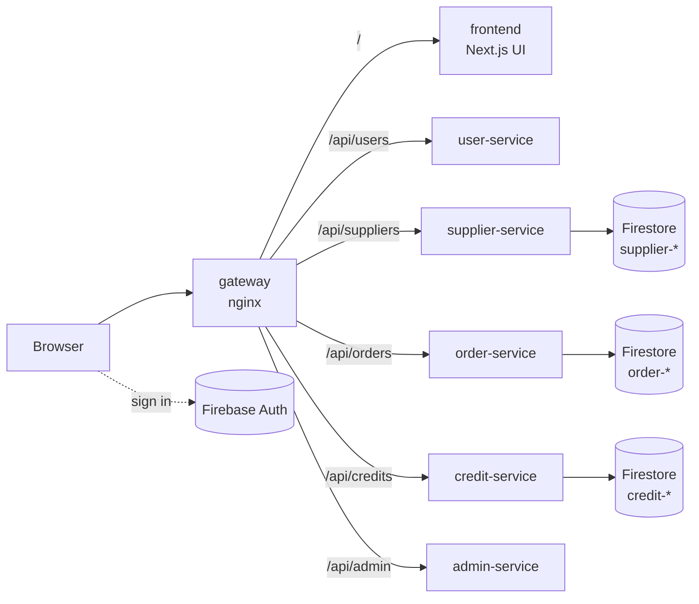

<!--
AI Assistance Disclosure:
Tool: OpenAI Codex (GPT-5), date: 2026-09-25
Mode: Documentation refactoring and disclosure assistance.
Scope: Assisted with documentation cleanup and Credit Service disclosure content.
Author review: I validated correctness and edited for style.
-->

# CS3219 — Software Design and Architecture (AY2627 Sem 1)

## Friend on Campus (FoC)

**Friend on Campus (FoC)** is a peer-to-peer campus errand platform where
students can request items to be collected from stores or facilities on
campus, and other students can fulfil (and deliver) those requests. The
platform runs on a closed credit economy — credits cannot be bought,
withdrawn, or exchanged for money, and only circulate within the platform.

---

## Team Members

| Name | Role |
| ----- | ----- |
| Khoo Yu Yien | TBC |
| Tham Yao Xiang | TBC |
| Oh Yi Xian | TBC |
| Zheng Jiongjie | Supplier Service (catalogue, search/filter API, supplier management UI); CI/CD pipeline & cloud deployment (NTH5: GitHub Actions, Cloud Run, Artifact Registry, Firestore, staging/production environments) |
| Choong Weng Sheng | TBC |

---

## Architecture



- **Microservices**: each backend service is an independent Spring Boot app with its own
  Firestore database (database-per-service). Services never read another service's data
  directly; they call its API.
- **Frontend**: a single Next.js app that only renders UI and calls the services' APIs.
- **Gateway**: nginx serves the UI and routes `/api/<service>` to each service, so the
  browser talks to one origin.
- **Auth**: users sign in with Firebase Auth; every service validates the Firebase ID
  token (`Authorization: Bearer ...`) and enforces roles itself.

## Tech Stack

| Layer | Technology |
| --- | --- |
| Backend services | Java 21, Spring Boot 4.1.1 (Web MVC, Security OAuth2 Resource Server, Validation, Actuator), Maven wrapper |
| Data | Google Cloud Firestore (one database per service per environment) |
| Auth | Firebase Authentication (ID tokens verified by each service) |
| Frontend | Next.js 16 (App Router), TypeScript, Tailwind CSS 4, shadcn/ui |
| Gateway | nginx |
| Testing | JUnit 5, Spring Boot Test, Testcontainers (Firestore emulator), JaCoCo (≥ 80% line + branch) |
| Containers | Docker, Docker Compose |
| CI/CD & cloud | GitHub Actions, Google Cloud Run, Artifact Registry, Workload Identity Federation |

---

## Repository Structure

This repository follows a **one-service-per-folder** structure: each
microservice lives in its own top-level folder.

```text
.
├── user-service/          # Spring Boot service (one per folder)
├── supplier-service/
├── order-service/
├── credit-service/
├── admin-service/         # N2H: admin dashboard backend
├── frontend/              # Next.js UI for every feature
├── gateway/               # nginx: routes /api/<service> and serves the UI
├── data/                  # seed data (CSV, images)
├── infra/
│   ├── environments/      # non-secret config per cloud environment
│   ├── firebase-emulator/ # local Firebase Auth + Firestore emulators
│   └── gcp/               # one-time GCP bootstrap (infrastructure as code)
├── scripts/ci/            # scripts used by the GitHub Actions workflows
├── docs/                  # CI/CD runbook, templates
├── .github/workflows/     # CI, staging and production pipelines
├── compose.yaml           # local deployment of the whole system
├── AGENTS.md              # conventions every service follows (humans and AI tools)
└── README.md
```

- Any **nice-to-have (N2H)** feature that warrants its own service should
  be added as an **additional folder** at the same level, following the
  same per-service structure.
- Files for agentic coding tools (e.g. agent configs, prompts, skills)
  may be added as needed, but must still **respect the
  one-service-per-folder skeleton** for core implementation.
- **Before adding or changing a service, read [AGENTS.md](AGENTS.md)**: it defines the
  folder layout, tech stack, runtime contract, API conventions and testing bar that every
  service follows.

---

## Getting Started (local, containerised)

Prerequisites: Docker Desktop. For development outside containers: JDK 21 and Node 24.

```bash
cp .env.example .env        # optional: override ports / admin emails
docker compose up --build
```

| URL | What |
| --- | --- |
| http://localhost:8080 | The app (gateway: UI + all APIs) — use this one |
| http://localhost:4000 | Firebase emulator UI (test users, Firestore data) |
| http://localhost:3000 | Frontend directly |

Locally, sign-in uses the Firebase **Auth emulator**: create an account on the sign-in
page (or in the emulator UI). Emulator accounts are separate from the cloud ones and are
kept across restarts in the `firebase-data` volume. Accounts whose email is listed in
`MOCK_ADMIN_EMAILS` (default `admin@u.nus.edu,e1398851@u.nus.edu`) receive the admin role.

---

## CI/CD and Environments

| Trigger | Workflow | Result |
| --- | --- | --- |
| Pull request / push to a branch | **CI** | Tests (+ coverage gate) and a Docker build for every changed service |
| Push to `main` | **Deploy staging** | CI, then images built once (tagged with the commit SHA) and rolled out to **staging** |
| Manual ("Run workflow") | **Deploy production** | Promotes the exact images staging verified to **production** |

Rollouts are health-checked on the new revision before it receives traffic; a failed
check leaves the previous revision serving. Details, rollback and setup:
[docs/ci-cd.md](docs/ci-cd.md).

A service joins CI/CD automatically once its `Dockerfile` has content.

### Using the cloud environments

| Environment | URL |
| --- | --- |
| Staging | https://gateway-staging-374055363871.asia-southeast1.run.app |
| Production | `https://gateway-production-374055363871.asia-southeast1.run.app` (after the first promotion) |

- **Always use the gateway URL above.** Each service also has its own `*.run.app` URL, but
  only the gateway routes `/api/*` to the backend services. Opening the frontend's own URL
  redirects you to the gateway.
- **Sign in** with an account in the team's Firebase project (`cs3219-p28-auth`), or create one
  on the sign-in page. The project enforces a password policy: at least 8 characters, with an
  uppercase letter, a lowercase letter, a number and a special character. The sign-up form
  shows a checklist as you type.
- **Admins** (while roles are mocked) are listed in `MOCK_ADMIN_EMAILS` in
  `infra/environments/<environment>.env`. Changes apply on the next deploy.
- Services scale to zero when idle, so the first request after a quiet period can take
  10–20 seconds.

---

## Contributing

1. Branch from `main`: `<your-name>/<topic>` (e.g. `zheng/supplier-search`).
2. Keep changes inside your service folder unless you are changing shared files.
3. Open a pull request; the **CI passed** check must be green before merging.
4. Never commit secrets or key files (`.env`, `*.json` service-account keys). They are
   git-ignored and CI fails if credential-like files are tracked.

---

## AI Use Summary

**Tools:** OpenAI Codex (GPT-5)

The team discussed and decided on the project requirements (FRs and NFRs), priorities, features, architecture, component boundaries, interfaces and data schemas. We did not outsource to AI to make those decisions or to write their rationales.

AI assistance was used for:

- generating the initial code implementation from the team-finalized design;
- generating Spring Boot, Maven, Docker, Compose, Cloud Run, and Firestore boilerplate;
- generating initial unit, integration, security, and OpenAPI tests;
- formatting and improving implementation documentation.

All AI-assisted output was reviewed for correctness and course compliance, edited where needed,
and verified with relevant automated tests. Exact available prompts, key-response summaries,
affected locations, and verification notes are recorded in
[`ai/usage-log.md`](ai/usage-log.md).
