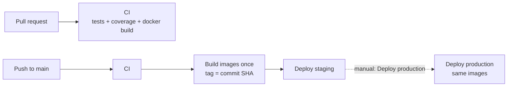

# CI/CD and cloud deployment

Owner: Zheng Jiongjie. This is the runbook for the FoC pipelines (NTH5).

## Overview



| Environment | Trigger | Cloud Run services | Firestore databases |
| --- | --- | --- | --- |
| local | `docker compose up` | – (containers) | Firestore emulator |
| staging | every push to `main` | `<service>-staging` | `<name>-staging` |
| production | manual **Deploy production** | `<service>-production` | `<name>-production` (delete-protected) |

- GCP project `protean-vigil-509704-q4`, region `asia-southeast1` (Singapore), images in
  Artifact Registry `asia-southeast1-docker.pkg.dev/protean-vigil-509704-q4/foc/<service>`.
- Public entry point per environment: the gateway,
  `https://gateway-<environment>-374055363871.asia-southeast1.run.app`. Staging:
  https://gateway-staging-374055363871.asia-southeast1.run.app.
- Only the gateway routes `/api/*` to the services. The frontend redirects direct visits
  to its own URL to the gateway (`FOC_PUBLIC_URL`, set by `frontend/deploy/env.yaml`).

## Workflows

### CI (`.github/workflows/ci.yml`)

Runs on pull requests and pushes to non-main branches, and is reused by the staging
deploy. `scripts/ci/list-services.sh` selects the services whose folder changed (all of
them if `.github/`, `scripts/ci/` or `infra/` changed). Per service:

- Maven project: `./mvnw -B verify` (unit + Testcontainers integration tests + JaCoCo
  ≥ 80% line and branch). The coverage report is uploaded as an artifact.
- npm project: `npm ci`, lint, type-check, `npm test` if present.
- Always: `docker build` of the service's own `Dockerfile`.

Plus repository checks: shellcheck, actionlint, `docker compose config`, and a guard that
fails if credential-like files are tracked. The **CI passed** job aggregates everything and
is the single required status check for `main`.

### Deploy staging (`.github/workflows/deploy-staging.yml`)

On every push to `main`: CI → build and push one image per service tagged with the commit
SHA → `scripts/ci/deploy.sh staging <sha>`.

### Deploy production (`.github/workflows/deploy-production.yml`)

Manual (**Actions → Deploy production → Run workflow**). With no input it promotes the
commit currently tagged `staging`; or give a full commit SHA. It verifies all images exist,
checks out that commit for the deploy configuration, and runs
`scripts/ci/deploy.sh production <sha>`. Images are **never rebuilt** for production.
To require approval before each production deploy, add required reviewers to the
`production` GitHub environment (not configured yet).

## How a rollout works (`scripts/ci/deploy.sh`)

For each service (backends → frontend → gateway):

1. Run `<service>/deploy/pre-deploy.sh` if present (e.g. upload seed files).
2. Render env vars: standard runtime variables (AGENTS.md §4) + `<service>/deploy/env.yaml`
   (envsubst with `infra/environments/<env>.env` and every `<SERVICE>_URL`).
3. `gcloud run deploy` as the service's own identity `foc-<service>@`. For an existing
   service the new revision gets **no traffic** and a `sha-xxxxxxx` tag URL.
4. Smoke test `HEALTH_PATH` on the new revision (12 tries, 5 s apart).
5. Healthy → switch 100% of traffic to it. Unhealthy → fail the job; the previous revision
   keeps serving.
6. After all services: tag the images `<environment>` in Artifact Registry.

### Per-service deploy config

| File | Purpose |
| --- | --- |
| `<service>/deploy/service.conf` | bash: `HEALTH_PATH` (default `/actuator/health`), `EXTRA_FLAGS=(--memory=512Mi ...)` |
| `<service>/deploy/env.yaml` | extra env vars; `${VARS}` from `infra/environments/<env>.env` and `<SERVICE>_URL`s |
| `<service>/deploy/pre-deploy.sh` | optional executable hook, receives `ENVIRONMENT` |

Service URLs are deterministic (`https://<service>-<env>-<project-number>.<region>.run.app`),
so any service can reference another as `${SUPPLIER_SERVICE_URL}` etc.

## Rollback

Traffic can be moved back to any earlier revision instantly:

```bash
gcloud run revisions list --service supplier-service-production --region asia-southeast1
gcloud run services update-traffic supplier-service-production --region asia-southeast1 \
  --to-revisions <revision-name>=100
```

Or re-run **Deploy production** with an older commit SHA (its images are still in the registry).

## Security model

- **No long-lived keys in GitHub.** Workflows authenticate with Workload Identity Federation:
  GitHub's OIDC token is exchanged for short-lived credentials of `foc-deployer@`, and only
  this repository (`Y2627S1-CS3219-P-28/FoC-P28`) is trusted.
- **Deployer permissions.** `foc-deployer@` has only what rollouts need:
  - `run.admin` on the project;
  - `artifactregistry.repoAdmin` on the `foc` repository (moving the `<environment>` tag deletes it from the previous image, which the writer role can't do);
  - `iam.serviceAccountUser` on each runtime identity;
  - `storage.objectAdmin` on the config buckets.
- **Least privilege at runtime.** Each Cloud Run service runs as `foc-<service>@`, which can
  only access its own Firestore databases (IAM condition on the database name).
- **Config vs secrets.** Non-secret settings are committed in `infra/environments/*.env`.
  Secrets go in Secret Manager and are mounted with `--set-secrets` in `EXTRA_FLAGS`.

## One-time setup (already done for this project)

```bash
gcloud auth login   # or activate an owner service account
infra/gcp/bootstrap.sh
```

The script is idempotent: re-run it after adding a service to `FIRESTORE_SERVICES`.

In GitHub, `main` is protected: merges need a pull request with a green **CI passed** check.
Adding required reviewers to the `production` environment is optional.

## Troubleshooting

| Symptom | Cause and fix |
| --- | --- |
| Smoke test gets **404 on `/healthz`** although the service runs | Cloud Run reserves some paths ending in `z`. Use a path like `/health`. |
| UI loads but data requests get **404 on `/api/...`** | The page was opened on a service's own URL instead of the gateway. Use the gateway URL (the frontend now redirects there). |
| Rollout succeeded but the job failed on `artifacts docker tags add` (`tags.delete` denied) | The deployer needs `artifactregistry.repoAdmin` on the repository (in `bootstrap.sh`). |
| Sign-up fails in the cloud but works locally | The cloud Firebase project enforces a password policy; the emulator doesn't. The sign-up form lists the rules. |
| **Repository checks** fails installing actionlint (`Connection reset`, `./actionlint: No such file`) | A network blip while downloading. The step now retries and verifies a pinned release; re-run the job if GitHub itself is down. |
| A new Firestore service fails in the cloud but works locally | Its databases don't exist yet: add it to `FIRESTORE_SERVICES` in `infra/gcp/bootstrap.sh` **and re-run the script** (the CI/CD owner does this). |
| First request is slow | Services scale to zero; a cold start takes 10–20 s. Set `--min-instances=1` in `EXTRA_FLAGS` for demos. |
| A deploy failed | Earlier services keep their previous revision. Fix the problem and re-run the failed job (`gh run rerun <id> --failed`), or push a fix. |
