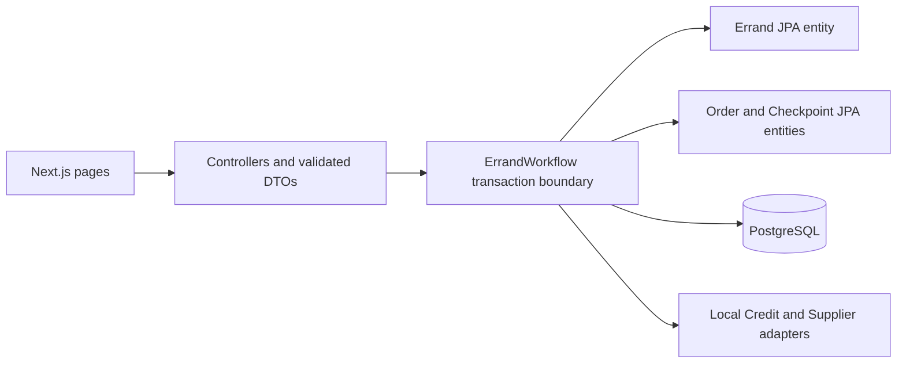

# Order Service

Java 21, Spring Boot 4.1.1, PostgreSQL 17. Sequences 1-6 have a local API and
frontend prototype: create, browse, accept, start, pickup and delivery.
Authentication and real Credit/Supplier integrations are deferred by user approval.

## Maven modules

Open this directory's `pom.xml` as the Maven project. It is the parent/aggregator;
each module has its own POM and standard `src/main/java`, `src/main/resources`,
`src/test/java`, and `src/test/resources` directories. Tests mirror their production
packages. Empty directories use `.gitkeep` so the structure survives checkout.

| Module | Responsibility |
| --- | --- |
| `orderservice.api` | Spring Boot startup, HTTP/security configuration, controllers and API mappers; executable JAR |
| `orderservice.api.contracts` | External request/response DTOs, API validation and errors |
| `orderservice.application` | Use cases, workflows, transaction boundaries and coordination |
| `orderservice.domain` | JPA entities, business rules, Spring Data repositories and gateway interfaces |
| `orderservice.domain.messaging.models` | Event and message payload definitions; no broker dependencies |
| `orderservice.infrastructure.db` | Existing database configuration dependencies and Flyway migrations; reserved for future adapters |
| `orderservice.infrastructure.gateway` | External service adapters |
| `orderservice.infrastructure.messaging.publisher` | Publishing adapters |

Errand and Order entities live in domain, as selected by Yao Xiang. Each module is a normal JAR;
only API applies Spring Boot repackaging. All modules remain one deployed Order Service.

Compile dependencies point inward: application depends on domain and message models;
database/gateway depend on domain; publisher depends on domain and message models.
API depends on application/contracts and includes infrastructure modules at runtime.
Add dependencies only to their owning module; the parent manages shared versions
and the existing JaCoCo 80% line/branch gates without inheriting runtime dependencies.

Runtime profile YAML files live in `orderservice.api/src/main/resources/`.
Migrations live in `orderservice.infrastructure.db/src/main/resources/db/migration/`
and are discovered from that module's JAR on the application classpath.

From this directory:

```powershell
.\mvnw.cmd clean verify
.\mvnw.cmd -pl orderservice.application -am test
```

Full application tests live in API because they verify startup and HTTP behavior with
all runtime adapters. Add focused database tests to infrastructure.db when it owns
database implementation behavior beyond the initial migration. Test and coverage
reports are module-local under `target/`; OpenAPI is written to
`orderservice.api/target/openapi.json`. The executable is
`orderservice.api/target/orderservice.api-0.0.1-SNAPSHOT.jar`.

## Local: Docker only

From this directory, with Docker Desktop running:

```powershell
docker compose -f compose.local.yaml up --build -d --wait
Invoke-RestMethod http://localhost:8083/actuator/health/readiness
```

No `.env`, Java installation, Cloud SQL, Firebase emulator, or manual database setup
is required. PostgreSQL: `localhost:5433`, database `order_service_dev`, user
`order_dev`, password `local_dev_only` (local development only).
Swagger: `http://localhost:8083/api/orders/docs`.

```powershell
docker compose -f compose.local.yaml logs -f order-service
docker compose -f compose.local.yaml down
```

`down` preserves data. `down -v` deletes it; only use for an intentional local reset.
Changing PostgreSQL initialization credentials does not change an existing volume.
The project name is `foc-order-local`. Previously used different project names own
separate volumes; do not delete old volumes merely to change projects.

## Local: IDE / Maven

Java 21 is required; Maven is supplied by the wrapper. Stop the containerized app
first if it occupies port 8083: `docker compose -f compose.local.yaml stop order-service`.

```powershell
docker compose -f compose.local.yaml up -d --wait postgres
$env:SPRING_PROFILES_ACTIVE = "local"
$env:PORT = "8083"
.\mvnw.cmd install -DskipTests
.\mvnw.cmd -pl orderservice.api spring-boot:run
```

`application-local.yaml` supplies the localhost database defaults. Compose supplies
the hostname `postgres` because container localhost is not the database.
Override `ORDER_DB_PORT` for Compose and `DB_URL` for the IDE if changing the DB port.
Rebuild the image after source changes, or use IDE mode for editing/debugging.

## Root Compose

From the monorepo root: `docker compose up --build -d --wait`.
For Order only: `docker compose up --build -d --wait order-service`.
Root Compose uses its own internal PostgreSQL and volume. The gateway already routes
`/api/orders`. Do not run isolated and root Order on the same host port concurrently;
stop one or override `ORDER_PORT`. Order currently has no emulator dependency.

## Configuration

| File | Purpose |
| --- | --- |
| `Dockerfile.local` | Local packaged JAR image, default `local` profile |
| `Dockerfile` | Production/CI layered image, default `prod` profile |
| `application.yaml` | Required DB variables, pool size, Flyway, probes, graceful shutdown |
| `application-local.yaml` | Local defaults, Hibernate `validate`, SQL logs, Flyway enabled |
| `application-prod.yaml` | Hibernate `validate`, Flyway enabled, SQL logs and Swagger disabled |
| `compose.local.yaml` | App and persistent PostgreSQL on ports 8083/5433 |
| `deploy/` | Existing Cloud Run pipeline configuration |

Both images run as non-root and include curl for health checks. Image builds skip
tests; CI runs them separately. Readiness includes PostgreSQL connectivity; liveness
does not. Never activate `local` in production.

## Production placeholders

Building does not require a database: `docker build -t foc-order-service:prod .`.
Production uses Cloud Run and `deploy/`, not Compose. Replace the placeholders in
`deploy/env.yaml` and configure the password secret as described below. Dummy values
cannot start a healthy application or provision Cloud SQL, networking, or permissions.

## How local and production settings stay separate

Both images package the same application code and YAML resources. At startup Spring
loads `application.yaml`, then the active profile's YAML overrides matching settings.
Profiles select configuration at runtime; Dockerfiles do not remove other profiles.

- Local Compose builds `Dockerfile.local` and explicitly sets
  `SPRING_PROFILES_ACTIVE=local`. Spring applies `application-local.yaml`:
  Flyway applies pending migrations, Hibernate validates tables, and SQL logs are enabled.
  Compose injects `DB_URL` with the Docker hostname `postgres`; an IDE run without
  that variable uses the local profile's `localhost:5433` default instead.
- Production CI builds `Dockerfile`, whose default profile is `prod`.
  Cloud Run's `deploy/env.yaml` explicitly sets the same profile and supplies the
  real database URL/username. `deploy/service.conf` injects the password from
  Secret Manager. Spring applies `application-prod.yaml`: Flyway runs, Hibernate
  validates, SQL logs and Swagger are disabled. Local credential defaults do not apply.
- Root `compose.yaml` is also a local environment. It selects `Dockerfile.local`
  and the `local` profile, but uses its own `order-postgres` service and volume.
  It is an alternative to isolated Compose, not a production configuration.

Runtime environment values can override image defaults, so never set the local
profile on Cloud Run. `.env.example` is documentation and is not automatically
loaded. Compose reads `.env` for interpolation, but production uses `deploy/` and
Secret Manager rather than your local `.env`.

## Cloud Run and Cloud SQL

CI automatically discovers `Dockerfile`. `deploy/service.conf` deliberately stops
rollout while placeholders remain. It does not prevent image builds.

1. Provision PostgreSQL, separate staging/production databases and users, enable
   the Cloud SQL Admin API, and configure backups/recovery.
2. Replace the database, username and instance connection name (`project:region:instance`)
   in `deploy/env.yaml`. Environment substitutions such as `${ENVIRONMENT}` can
   distinguish staging/production names; the existing deploy script renders them.
3. Create a password secret per environment. Set `ORDER_DB_PASSWORD_SECRET` in the
   corresponding `infra/environments/<env>.env` to its Secret Manager name.
4. Grant the Order runtime service account Cloud SQL Client and access to that secret.
   Current repository bootstrap does not provision these SQL resources.
5. The included Google JDBC connector uses Cloud Run's identity, encrypted connections,
   lazy refresh and public IP. Enable public IP on SQL. Private-only SQL additionally
   needs `ipTypes=PRIVATE` and configured Cloud Run VPC connectivity.
6. Deploy staging, verify migrations/readiness, then promote with the existing pipeline.

Passwords belong in Secret Manager, not `deploy/env.yaml` or images. No service-account
key is needed on Cloud Run. Updating a URL cannot create a database or grant permissions.
Connector reference: https://github.com/GoogleCloudPlatform/cloud-sql-jdbc-socket-factory/blob/main/docs/jdbc.md.

## Schema and verification

Flyway runs before Hibernate validation in both local and production. V1 establishes migration history
only; no business entities exist. Add new versioned migrations alongside future entity
changes. Do not edit applied migrations or automatically baseline a dirty local database.
Local Hibernate-generated tables are not production migrations.

## Sharing schema changes with Vincent

Each developer keeps a separate local PostgreSQL database. Git shares the schema
instructions, not database rows. Equal code and migration versions produce the same
managed schema after successful startup; pulling Git alone does not update a database.

1. Before an approved entity/schema change, pull the team's agreed integration branch
   and coordinate the next migration version with the other developer. Existing V1
   is retained. Use V2, V3, etc. and descriptive names with two underscores, e.g.
   `orderservice.infrastructure.db/src/main/resources/db/migration/V2__create_orders.sql`. Do not create this example
   until the domain schema is approved. Never reuse a shared version number.
2. Include forward SQL for the change and required data backfills in the same commit
   as entities/repositories. Codex must provide the migration path, purpose, prerequisites,
   data impact, verification and teammate commands in the handoff. Hibernate validation
   checks compatibility; it does not generate migrations or exhaustively compare schemas.
3. Run `.\mvnw.cmd verify`. For each real schema change, test both a clean database
   and upgrade from the previous version with representative existing data. Cover
   constraints, defaults/backfills and failure cases. Do not test against a teammate's DB.
4. Review and share via Git. The receiving developer pulls/merges the agreed commits,
   then runs from `order-service` (Docker Desktop running):

   ```powershell
   docker compose -f compose.local.yaml up --build -d --wait order-service
   docker compose -f compose.local.yaml logs --tail 100 order-service
   docker compose -f compose.local.yaml exec -T postgres psql -U order_dev -d order_service_dev -c "SELECT installed_rank, version, description, success FROM flyway_schema_history ORDER BY installed_rank;"
   ```

   Rebuild is required because SQL files are packaged into the application image.
   Flyway applies only pending migrations at startup, then Hibernate validates.
   Both developers can compare migration versions using the query above.
5. Never edit/delete an applied or shared migration, enable Hibernate `update`, enable
   out-of-order execution, automatically baseline, or run Flyway repair to bypass drift.
   If two branches collide, coordinate before merging. An unpublished, unapplied script
   can be renumbered; if either script has been applied/shared, inspect both histories
   and agree a recovery plan. Do not blindly renumber applied migrations.

Root Compose uses the same migrations. From the root, rebuild using
`docker compose up --build -d --wait order-service`; its database service is
`order-postgres` instead of `postgres`. The two Compose stacks have separate volumes.

For an existing Hibernate-managed database without Flyway history, stop and inspect
its tables and data first. Back up valued data and plan a reviewed migration/baseline.
Only reset a disposable database with its owner's explicit approval. Do not delete
volumes as a routine synchronization step. Switching to an older branch may not work
against a newer schema; use a separate disposable database rather than undoing shared SQL.

```powershell
.\mvnw.cmd verify
docker compose -f compose.local.yaml config --quiet
```

Tests use isolated Testcontainers PostgreSQL and require Docker; they never reuse
your local/production database. They verify Flyway startup, readiness, production
diagnostic restrictions and OpenAPI generation. No business endpoints exist, so the
OpenAPI test permits an empty paths object. Strengthen that condition when adding
the first approved controller. JaCoCo has Supplier's 80% line/branch rule and excludes
the bootstrap class; there is no business code coverage to report yet.

Firebase authentication/authorization must be implemented before exposing real Order
APIs. This scaffold is not a completed production rollout or business feature.

## Sequences 1-6 prototype

Only `local` and `test` profiles expose these APIs and dummy adapters. Adding `prod`
disables them even alongside another profile. No real credit balance is read or changed.
Demo IDs are caller-supplied and do not authenticate a user; local ownership comparisons
still reject own acceptance and another courier's progress updates.

| Method | Path under `/api/orders` | Result |
| --- | --- | --- |
| POST | `/errands` | Create an OPEN Errand (201); replay the same command safely |
| GET | `/errands?page=1&size=20` | OPEN/unexpired errands; size at most 100 |
| GET | `/errands/{id}` | Current posting and accepted execution ID |
| POST | `/errands/{id}/accept` | Atomically assign one courier and create an ACCEPTED Order |
| GET | `/executions/{id}` | Execution, listing details and four possible progress checkpoints |
| POST | `/executions/{id}/start` | ACCEPTED -> IN_PROGRESS; sets actual startedAt |
| POST | `/executions/{id}/pickup` | IN_PROGRESS -> PICKED_UP; records pickup supplier ID |
| POST | `/executions/{id}/deliver` | PICKED_UP -> DELIVERED; records delivery supplier ID |
| GET | `/prototype/suppliers` | Three explicitly marked sample locations |

Create body: `commandId`, `requesterId`, `description` (10-100 characters, no controls),
`pickupSupplierId`, `deliverySupplierId` (distinct fixture IDs), positive whole
`creditAmount`, `deliveryDurationMinutes` (15-1440), `expiresAt` (UTC ISO instant,
at least 30 minutes ahead). There is no scheduled availability time.
Mutation body: `commandId`, `actorId`, `expectedVersion`. Reuse the exact command
and body after an uncertain response; a reused command with changed input returns 409.
Read the latest version after a conflict. The execution's duration starts at `startedAt`;
listing expiry prevents acceptance, not subsequent progress. Delivery is not completion.



Application services coordinate; domain methods enforce acceptance and progress rules.
MapStruct generates entity/view-to-DTO mappings in API. Row locks, expected versions,
command fingerprints and unique checkpoint constraints protect updates/retries.
Create/accept/progress and their local records commit atomically. Reservation rollback
calls the dummy release after transaction completion; neither function moves funds.
Creation success is returned directly over HTTP; there is no messaging infrastructure.

Run the frontend from `../frontend` (the environment variable only affects Next dev):

```powershell
npm ci
$env:FOC_ORDER_DEV_URL = 'http://127.0.0.1:8083'
$env:PORT = '3100'
npm run dev
```

Open `http://localhost:3100/requests/new` or `/errands`. No login is needed for these
prototype pages. Use different demo requester/courier IDs; acceptance opens the delivery
page. Keep its URL to resume. Other service pages and their authentication are unchanged.
The optional dev proxy applies only to `/api/orders`; deployed traffic uses the gateway.

### Verification and teammate handoff

`./mvnw verify` runs module unit tests and PostgreSQL-backed HTTP/OpenAPI tests, including
invalid fields, expiry exclusion, illegal/foreign/stale transitions, duplicate commands,
checkpoint persistence and disabled production endpoints. Coverage gates remain 80%
line and branch for handwritten code. Only bootstrap and generated MapStruct code are
excluded. MapStruct configuration follows https://mapstruct.org/documentation/stable/reference/html/ .
Frontend: `npm run lint`, `npm run typecheck`, and `npm run test:orders` (backend must run).
Install the test browser with `npx playwright install chromium`, or set
`PLAYWRIGHT_CHANNEL=chrome` to use installed Chrome. Browser tests cover desktop 1920 px
and mobile 320 px, all six steps, role-relationship controls and network error retry.

V2 adds errands, delivery_orders, order_checkpoints and order_commands; V1 is unchanged.
Rebuild with `docker compose -f compose.local.yaml up -d --build --wait`, then inspect:

```powershell
docker compose -f compose.local.yaml exec -T postgres psql -U order_dev -d order_service_dev -c 'select version, description, success from flyway_schema_history order by installed_rank;'
```

Expected: successful versions 1 and 2. No reset, baseline or Hibernate update is needed.
The existing local V1 database was upgraded in place; fresh databases are tested separately.
Coordinate later migration versions with teammates; do not edit an applied V2 migration.

This milestone is a prototype, not verified real integration. Firebase/roles, real Credit
reserve/recovery and Supplier APIs remain pending. Repost configuration/execution, account
history, completion, cancellation and other sequences beyond this six-step core are not
implemented. Future integration must remove the dummy adapters and verify the actual
Errand-to-Credit reservation identity mapping before moving real credits.
