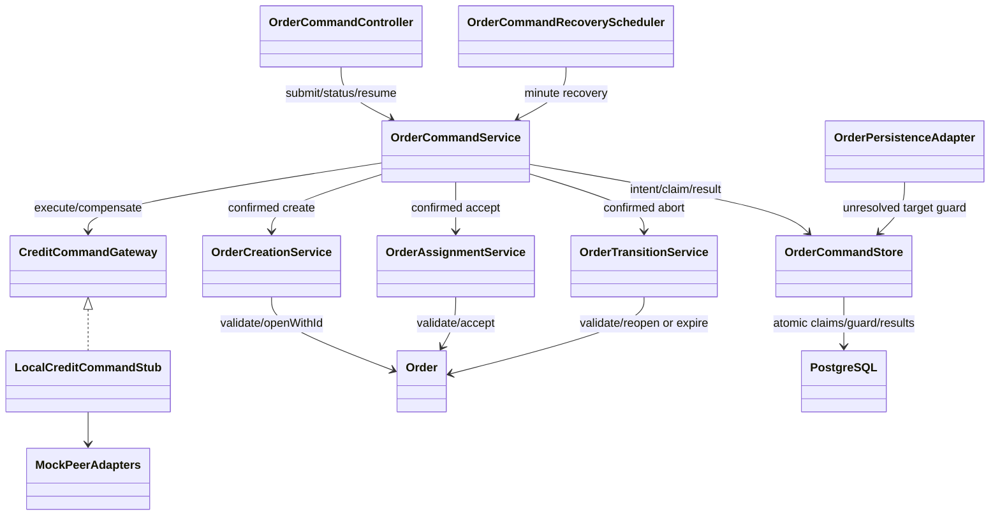

# Order–Credit synchronous command recovery handoff

Vincent · `sprint-2-3-credit-service-concurrency` · 2026-10-10

Authority: ADR-033, ARCH-EVO-038, CHANGE-100. Owner of Credit work: Annablee.

## What is implemented, and what is not

Order and the shared frontend have an **approved contract-stub implementation**
for creation, acceptance and accepted-only abort. It uses real PostgreSQL/Flyway
for Order intent, claims and results, and a process-local Credit protocol stub.
**Live HTTP command recovery is hard disabled** until the following Credit
protocol is agreed, implemented and verified. Existing HTTP-peer routes still
use the legacy synchronous adapter; they do not acquire these new guarantees.
No Credit source, Credit database, broker setup or shared token contract was
modified. This is a request for provider work, not a verified shared contract.

The stub's financial state/history is in memory. Restarting that stub is NOT a
test of a durable Credit ledger. Order's saved commands survive restart, but
production financial crash safety requires Credit's durable command records.
Repost recovery and delegated service credentials remain deferred under ADR-027.

## Minimal business requests: keep these bodies unchanged

All paths below are relative to `/api/credits`. `Authorization: Bearer <fresh
Firebase ID token>` remains required. Never trust a body ID instead of the
validated caller. Do not send descriptions, supplier names, order snapshots,
expiry plans, penalties or the complete Order command JSON to Credit.

| Order action | Existing Credit endpoint | Exact business JSON | Current response |
| --- | --- | --- | --- |
| CREATE → OPEN | `PUT /orders/{candidateOrderId}/reservation` | `{"requesterId":"requester-uid","amount":5}` | 201 new / 200 replay, existing `ReservationResponse` |
| OPEN → ACCEPTED | `PUT /orders/{orderId}/courier-assignment` | `{"courierId":"courier-uid"}` | Exactly 200, empty body |
| ACCEPTED → abort outcome | `POST /orders/{orderId}/hold-for-reopen` | **No body** | Exactly 200, empty body |

Credit already implements these endpoints, but replay is based on current
reservation state. That is insufficient for historical command recovery.
For example replaying an old reset must never clear a later acceptance.

### Proposed additional headers (not implemented in the HTTP adapter yet)

```http
Authorization: Bearer <current user token>
Idempotency-Key: <K generated once by the frontend>
X-Command-Generation: <positive monotonically increasing Order claim generation>
```

K identifies one logical action; the generation identifies its current worker.
Different actions—even on the same order—have different K values. A CREATE
command also gets one new candidate order UUID generated and saved by Order;
all its retries use that same candidate. ACCEPT and ABORT keep the current
business order ID. K and candidate ID are **not** authentication credentials.

For compatibility, keep the three existing success bodies/statuses above.
**Proposed response headers** are `Idempotency-Key: K` and
`Command-Outcome: APPLIED | REJECTED | COMPENSATED`. A saved command-result
lookup below supplies historical outcome JSON. Provider approval and contract
tests must settle exact header names before a live Order adapter is written.

## New provider operations required

### 1. Authorized historical result lookup

Proposed `GET /api/credits/commands/{K}`; no body. Authenticate the requester or
courier who owns K, independently of whether they remain courier-eligible for
a **new** task. Never expose another account's commands. A former courier must
still be able to establish the outcome of their own already-issued action.

200 minimal result JSON:

```json
{
  "commandId": "K",
  "operation": "RESERVE",
  "orderId": "candidate-or-existing-order-id",
  "outcome": "APPLIED",
  "code": "SUCCEEDED"
}
```

Operations: `RESERVE`, `ASSIGN_COURIER`, `CLEAR_COURIER`.
Outcomes: `APPLIED`, `REJECTED`, `COMPENSATED`; use 202 + `PENDING` if the
provider intentionally exposes a committed in-progress record. Return 404
`COMMAND_NOT_FOUND` only when no committed result exists. A 404 alone does not
fence an in-flight request; Order may replay the **same** action/key, not create
another action. Do not use the current reservation alone as historical proof.

### 2. Conditional compensation / fencing

Proposed `POST /api/credits/commands/{K}/compensate`; **no body**. K identifies
the original action, whose immutable saved record supplies actor, order and
amount. Use the same authorization and generation headers. This is a lifecycle
operation on the original command, not permission to bind K to different input.
Repeated compensation returns its saved result without another financial effect.

200 result JSON uses the same five fields, with `outcome: "COMPENSATED"` and
`code: "REVERSED"` or `"FENCED_NO_EFFECT"`. If safe reversal is impossible,
409 `RECONCILIATION_REQUIRED` leaves the original command unresolved at Order.
401/403 are authorization failures of this attempt, **not** evidence that an
earlier attempt did not commit.

- RESERVE: reverse only that command's still-held, unassigned reservation;
  never refund an already settled/transferred or unrelated reservation.
- ASSIGN_COURIER: clear only the assignment produced by K. Credit must retain
  the assignment command identity/revision. Matching the courier UID alone is
  insufficient when the same courier accepts the same reopened order again.
- CLEAR_COURIER: do not blindly reassign a courier. Return the historical clear
  result or reconciliation-required. Order's normal unresolved guard prevents
  a new acceptance until this action is resolved.
- If the original action has not applied, compensation must **fence it**:
  an older delayed execute request must not apply afterward.

## What each Credit handler must do internally

1. Validate token/signature/subject, operation permission and field ownership.
   A key, generation or `requesterId` never bypasses authorization.
2. In one Credit database transaction, claim/lock K and lock the affected
   reservation/account rows. Use a uniqueness constraint, not a Java mutex.
3. Bind K immutably to authenticated actor, operation, order ID and canonical
   business input. Return 409 `IDEMPOTENCY_KEY_REUSED` for different binding;
   do not mutate the original record or advance its fence on that mismatch.
4. If a terminal historical result exists, return it. **Do not execute the
   financial operation again**, even if current reservation/courier differs.
5. Reject a stale generation without applying or compensating. Persist the
   highest accepted generation so a paused older worker cannot undo a newer one.
6. Apply balance/reservation/assignment change and save its terminal result
   **in the same transaction**. A definite no-effect business rejection is a
   saved `REJECTED` result as well. Commit before returning success/rejection.
7. If Credit crashes before commit, both financial writes and result roll back;
   same-key retry can proceed. If it crashes after commit/before response, retry
   returns the saved result. Neither case needs a second financial effect.
8. Conditional compensation also commits its financial reversal, fence and
   recorded result together. Replays cannot compensate twice.

A separate committed Credit `PENDING` row is optional if the Credit action is
entirely local and atomic. If Credit chooses one, it needs its own durable claim,
lease and recovery—not a permanently orphaned `PENDING` entry. Recording only
a key before the transaction or only a result after it does not give atomicity.
Retain historical records/fences long enough for browser, Order and operational
recovery; do not expire them while commands can still be replayed.

### Outcome handling at Order

| Evidence | Order behavior | Browser behavior |
| --- | --- | --- |
| Authoritative applied result + still-valid transition | Atomic Order/history/receipt/outbox + COMPLETED/SUCCESS | Clear saved intent, normal new state |
| Authoritative saved no-effect rejection | COMPLETED/REJECTED, business state unchanged | Clear saved intent, short appropriate error |
| Timeout, disconnect, crash, 5xx or uncertain response | Keep PENDING and retry time; never guess failure | Disabled pending action, attempt message |
| Later 401/403 | PENDING/AUTHORIZATION_REQUIRED, preserve uncertainty | Continue with fresh authentication |
| Credit applied but deadline/state no longer valid | Conditional reverse/reconcile; only resolve after alignment | Pending until aligned, then terminal message |
| Active lease / competing same K | Return existing saved status; no second worker | Still pending |

Current known legacy failures include reservation 404 account-not-found / 409
insufficient funds or conflicting details. These are not automatically definitive
for K after an earlier unknown attempt. Historical result semantics must decide.

## Order implementation sequence and persistence

```mermaid
sequenceDiagram
    participant B as Browser
    participant O as Order coordinator
    participant D as Order PostgreSQL
    participant C as Credit protocol stub / future verified provider
    B->>B: Persist K + frozen input in account-scoped IndexedDB
    B->>O: Submit K + input, fresh token
    O->>D: Register immutable PENDING + candidate/target; COMMIT
    O->>D: Atomic claim(owner, lease, generation); COMMIT
    O->>D: Validate under order lock; commit possible-effect barrier
    O->>C: Same K + generation + minimal business request
    alt Confirmed applied and locally valid
        O->>D: One transaction: Order/history/outbox/receipt + COMPLETED/result
        O-->>B: 200 terminal SUCCESS
    else Confirmed no-effect rejection
        O->>D: COMPLETED/REJECTED; COMMIT
        O-->>B: 200 terminal REJECTED
    else Applied remotely but local deadline/state is no longer valid
        O->>C: Conditionally compensate/fence the original K
        alt Reversal confirmed
            O->>D: Commit COMPLETED/REJECTED
            O-->>B: Terminal rejection after consistency restored
        else Reversal not established
            O->>D: Retain PENDING / reconciliation required
        end
    else Uncertain / response lost
        O->>D: PENDING, nextRetryAt, safe message; release claim if alive
        O-->>B: 202 PENDING (crash may produce no HTTP response)
        B->>O: Poll owned command every 5 seconds while visible
    end
    Note over O,D: Minute recovery: due retry time AND no valid lease<br/>Authorization-required commands wait for user Continue
```

The DB condition is `PENDING AND next_retry_at <= clock_timestamp() AND
(lease_expires_at IS NULL OR lease_expires_at <= clock_timestamp())`.
An atomic conditional update claims before any unsafe I/O. Finalization checks
owner + generation + valid lease under a command row lock. A unique pending
target index and repository guard block other keys, cancel/expiry/start and
other transitions while the financial outcome is unresolved. No DB transaction
is held open just to wait for a network response. This is not exactly-once HTTP;
Credit deduplication/fencing delivers one **logical** effect despite duplicate I/O.

Current class responsibilities:



- `OrderCommandController`: capability, submit/status/owned discovery/resume.
- `OrderCommandService`: commit intent/claim, validation, remote result and
  atomic finalizer or compensation; never store a bearer token.
- `OrderCommandStore`: immutable JSON/hash, claims/fences/guard/results via JDBC.
- Existing creation/assignment/transition services: same domain rules, explicit
  confirmed variants avoid a second Credit effect; existing domain is invoked.
- `OrderCommandRecoveryScheduler`: every minute, mock-only hard gate.
- `CreditCommandGateway` / `LocalCreditCommandStub`: approved protocol seam,
  historical key replay and generation-aware reversal **only in memory**.
- Frontend `useOrderCommand`: browser persistence and disabled pending action;
  `PendingOrderCommands`: owned discovery independent of order cards.

## Migration and operational handoff

Flyway **V5__durable_foreground_commands.sql** adds only `order_commands` plus
its constraints/indexes. Never edit V1–V4. Expected schema version is 5. The
normal Order startup applies Flyway; an upgrade must preserve prior orders,
attempt history and outbox events. Do not use `ddl-auto=update` or delete volumes.

Configuration: `order.commands.enabled` (default true but hard mock-only gate),
`order.commands.cron` (`0 * * * * *`), lease-seconds (120), retry-seconds (15),
batch-size (20). The minute scan means a 15-second due retry can run on the next
minute tick. `-` disables the scan for isolated tests. Cloud Run scale-to-zero
does not guarantee a minute tick; deployment scheduling is not changed here.
No lease heartbeat exists in this stub slice; before production, bound remote
timeouts or approve renewal and verify stale-worker fencing across restarts.

Recovery: retain command rows, never delete PENDING to unlock an order. A
schema rollback must not discard unresolved financial evidence. Disable the
protocol/worker, preserve records, reconcile with the provider and deploy a
forward corrective migration if needed. Browser intents contain no credentials
but remain account-scoped application data and should not be copied to logs.

## Tests and live-enablement checklist

Order tests: `OrderCommandRecoveryIntegrationTest` (real PostgreSQL),
`CreditCommandStubTest`, `OrderCommandControllerTest`, `OrderCommandSecurityTest`,
`OpenApiDocumentationTest`, migration and legacy concurrency suites. Frontend:
`use-order-command.test.tsx`, `pending-order-commands.test.tsx`, companion page
and action regressions. Executed results are recorded in CHANGE-100.

Before enabling HTTP recovery, Annablee and Vincent must agree and verify:

- Historical identical replay and conflicting input rejection on all 3 routes.
- Authorized result retrieval without requiring renewed courier eligibility.
- Commit+lost response and pre-/post-commit Credit restart cases on a real ledger.
- Generation fencing and conditional reversal, including courier A accepting
  twice, stale reset and stale compensator after a newer assignment.
- Order commit failure, expiry during remote acceptance and no phantom OPEN.
- Concurrent browser/scheduler/same-key/different-key runs across replicas.
- No stored tokens; authorization-needed UI and fresh same-key resume.
- New real HTTP adapter + compatibility/status/header contract tests.
- Authenticated browser and live peer/runtime verification, coverage and
  operational monitoring. A stub pass does not complete these gates.
