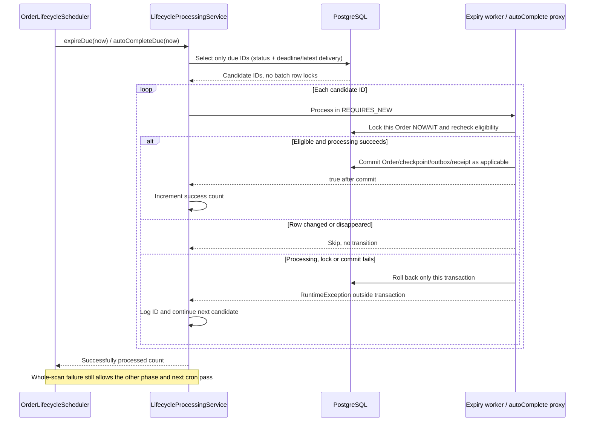
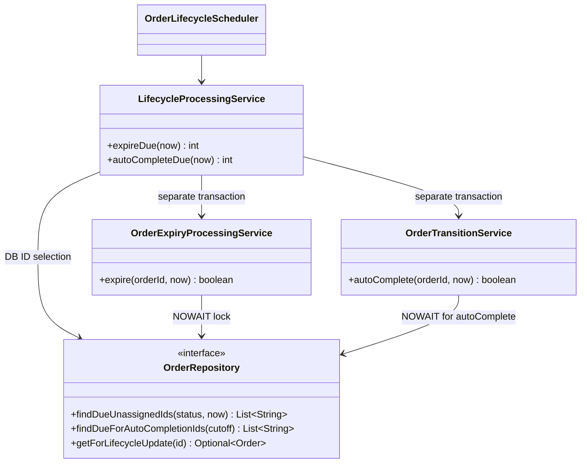

# Attached Order flow: approved amendments and implementation gaps

## Effective minute job — CHANGE-102 / ADR-034

This sequence supersedes the separate command timer. The job itself is not a
single database transaction. Every phase has an independent catch; existing
per-order transactions, locks, pending guards and leases remain authoritative.
Automatic-repost/background retry scope is unchanged.

```mermaid
sequenceDiagram
    participant Tick as OrderLifecycleScheduler (every minute)
    participant Commands as OrderCommandService
    participant Lifecycle as LifecycleProcessingService
    Tick->>Commands: recoverDue() (existing mock-only gate)
    Commands-->>Tick: resolved / still pending / caught failure
    Note over Tick: Capture lifecycle time AFTER recovery
    Tick->>Lifecycle: expireDue(now): OPEN + unassigned + due + no unresolved command
    Lifecycle-->>Tick: successful expiries queue refunds; failures remain eligible
    Tick->>Lifecycle: autoCompleteDue(now): DELIVERED + latest delivery at least 48h ago
    Lifecycle-->>Tick: successful completions queue completion events
    Note over Tick,Lifecycle: Continue later phases after errors; no deadline bypass
```

Outbox publication is still immediate after commit; a separate every-15-minute
scan recovers pending/failed refund, completion and accepted-cancellation events.

## Effective compact-event amendment — CHANGE-092 / ADR-031 (2026-10-09)

Yao Xiang approved the exact seven-field Order-only payload: eventId, eventType, orderId, orderStatus, creditAmount, occurredAt, courierId. This replaces full snapshots and overdue facts ONLY for OpenOrderRefundTaskEvent and OrderCompletionTaskEvent. AcceptedOrderCancellationTaskEvent retains its existing v1 envelope/snapshot. Internal outbox versions and Pub/Sub eventVersion attribute remain (compact schema v2); topic names and DB schema unchanged. Old pending snapshot rows normalize at dispatch from their saved facts, with stable IDs. Lifecycle/outbox scheduling, locks, synchronous Credit assignment/reset and ADR-025 abort behavior remain. Historical v1 descriptions below are superseded for these two bodies. Credit currently requires the old snapshot and overdue; FEEDBACK-009 is INCOMPLETE_OR_INCOMPATIBLE. User completion penalties need an agreed separate overdue source. User approved implementing Order-only and documenting peer work; live integration remains blocked, Sprint [~].


CHANGE-088 adds only the [ADR-029 local transport sequence](../decisions/ADR-029-local-live-credit-push.md)
and [test runbook](../local-live-testing.md). Lifecycle boxes/rules below remain
unchanged: immediate after-commit plus 15-minute recovery, minute lifecycle.
Actual financial delivery now has an opt-in connector, not verified cloud results.

Authority: Vincent's PNG plus textual corrections, CHANGE-083 / ADR-026 and
retained ADR-025 and CHANGE-084 / ADR-027 retry/polling decisions; CHANGE-086 /
ADR-028 implements explicit expiry/latest outcomes. Source PDF/PNG artifacts are not overwritten. This is an
**approved target**, not a claim of 100% implementation. CHANGE-086 implements
explicit automatic expiry and latest safe manual/automatic failure persistence;
V4 disables legacy plans without an explicit expiry by Vincent's decision.
Durable retries remain unimplemented. CHANGE-085 implements visible-page polling.
Latest user explicitly PAUSES ALL background retry implementation until peers agree.
Trusted peer credentials are approved for discussion/documentation ONLY;
implementation explicitly deferred pending peer agreement.

| Requirement | Current implementation |
| --- | --- |
| One every-minute recovery -> OPEN expiry -> >=48h latest-DELIVERED completion | ADR-034: sequential; mock-only command recovery; lifecycle time captured afterward and shared by the two checks. Independent item transactions and phase failures. |
| All-three-event outbox recovery every 15min, immediate dispatch retained | Implemented; publication acknowledgement is not refund completion. |
| Creation-time automatic choice only | Implemented; post-creation configuration rejected. |
| NEW automatic expiry >= due +30min; due >= original expiry; run late only before NEW expiry | CHANGE-091 / ADR-030; saved explicit-expiry plans grandfathered unchanged. Exact saved deadline used; prior V4 disable-without-expiry remains. |
| Auto/manual new business IDs; abort reopen same business ID and separate immutable attempt UUID | Implemented. Old repost originals/outbox retained; linked originals hidden from requester queries. |
| EXPIRED/CANCELLED refund and every-abort User penalty | Implemented Order-side; missing peer routes/subscribers in feedback. |
| Validate Supplier response before reservation | Repaired: explicit valid:true required; valid:false/missing confirmation rejects. |
| Confirm matching active Credit reservation | Request is synchronous but response body discarded; confirmation/recovery gap remains. |
| Failed repost EXPIRED; short confirmed insufficient/permanent failure message; retry only temporary failures before new expiry with same candidate ID | Latest safe manual/automatic attempt failure persists on original EXPIRED row after rollback; overwritten/cleared safely. All background retry implementation PAUSED pending peer agreement. |
| Authenticated polling for near-real-time lists/status/balance | Implemented: every 15 visible/auth-ready seconds; focus/mutation refresh, cleanup/no overlap/stale guards. |

The Mermaid below preserves the supplied creation/progress/abort/refund/repost
branches. TARGET labels mark approved but unimplemented nodes; credential
delegation remains a documentation-only proposal. The dashed retry edge shows
the approved principle, not an implemented worker. Topics/payloads/provider work:
[peer feedback](../peer-service-api-feedback.md).

```mermaid
flowchart TD
    CREATE["Requester POST /api/orders"] --> VERIFY["Verify User requester, Supplier valid:true,<br/>domain Order fields"]
    VERIFY --> PLAN{"Automatic repost enabled at creation?"}
    PLAN -->|Yes| TIMES["NEW plans: explicit repostExpiresAt<br/>repostExpiresAt >= repostDueAt + 30 minutes<br/>repostDueAt >= original.expiresAt<br/>Configure credits/duration; quarter-hour UI"]
    PLAN -->|No| RESERVE
    TIMES -->|Valid| RESERVE["Credit PUT /api/credits/orders/NEW-ID/reservation<br/>JSON requesterId, amount; synchronous 200/201"]
    TIMES -->|Invalid| NOOPEN["No new OPEN; return validation error"]
    RESERVE -->|Failure| NOOPEN
    RESERVE -->|Confirmed matching RESERVED| OPEN["OPEN; persist Order/checkpoint/receipt"]

    TICK["ONE scheduler every minute<br/>1: eligible command recovery (mock-only)<br/>then 2: expiry; then 3: completion<br/>Independent phase catches / item transactions"] -->|Phase 2: after recovery| EXPIRY{"Still OPEN, courier null,<br/>expiresAt reached; no unresolved command?"}
    OPEN --> EXPIRY
    EXPIRY -->|Yes| EXPIRED["EXPIRED; keep original business ID"]
    TICK -->|Phase 3: after expiry pass| COMPLETECHECK{"Still DELIVERED;<br/>latest delivery at least 48 hours ago?"}
    COMPLETECHECK -->|Yes| COMPLETED
    OPEN --> CANCEL["Requester POST /api/orders/ID/cancel"]
    CANCEL --> CANCELLED["CANCELLED"]
    CANCELLED --> REFUND
    EXPIRED --> REFUND["Queue OpenOrderRefundTaskEvent<br/>open-order-refund-dev-v1 -> Credit<br/>Refund the OLD-ID reservation"]

    OPEN --> ACCEPT["Courier POST /api/orders/ID/accept<br/>Eligibility/version/deadline; reject self-acceptance"]
    ACCEPT --> ASSIGN["Credit PUT /api/credits/orders/ID/courier-assignment<br/>JSON courierId; provider missing"]
    ASSIGN -->|Exactly 200; recheck expiry| ACCEPTED["ACCEPTED; same ID"]
    ASSIGN -->|Failure| OPEN
    ACCEPTED --> START["Assigned courier POST /api/orders/ID/start"]
    START --> PROGRESS["IN_PROGRESS"]
    PROGRESS --> PICKUP["Assigned courier POST /api/orders/ID/pickup"]
    PICKUP --> PICKED["PICKED_UP"]
    PICKED --> DELIVER["Assigned courier POST /api/orders/ID/deliver"]
    DELIVER --> DELIVERED["DELIVERED"]
    DELIVERED --> COMPLETECHECK
    DELIVERED --> CONFIRM["Requester POST /api/orders/ID/complete"]
    CONFIRM --> COMPLETED["COMPLETED; calculate overdue facts<br/>Save completion and event intent atomically"]
    COMPLETED --> COMPLETION["Queue OrderCompletionTaskEvent<br/>order-completion-dev-v1 -> Credit and User<br/>Settlement and on-time/overdue consequences"]

    ACCEPTED --> ABORT["Assigned courier POST /api/orders/ID/cancel-accepted<br/>Abort allowed only while ACCEPTED"]
    ABORT --> RESET["Credit POST /api/credits/orders/ID/hold-for-reopen<br/>No body; clear courier/retain reservation; provider missing"]
    RESET -->|Failure| STILLACCEPTED["Remain ACCEPTED; no new history/events"]
    RESET -->|Exactly 200| HISTORY["Immutable ABORTED courier attempt<br/>Same business ID; separate attempt UUID"]
    HISTORY --> PENALTY["Queue AcceptedOrderCancellationTaskEvent<br/>accepted-order-cancellation-dev-v1 -> User<br/>actorId identifies aborting courier"]
    HISTORY --> ORIGINALTIME{"Original expiry still in future?<br/>Recheck after Credit response"}
    ORIGINALTIME -->|Yes| REOPEN["Current OPEN, courier null<br/>Same business ID/reservation; no refund"]
    REOPEN --> OPEN
    ORIGINALTIME -->|No| EXPIRED

    EXPIRED --> AUTOCALL["POST /api/orders/internal/lifecycle/repost<br/>Trusted peer credentials proposal ONLY; DO NOT implement yet"]
    AUTOCALL --> AUTOELIGIBLE{"Auto enabled/unused, no linked repost;<br/>repostDueAt reached?"}
    AUTOELIGIBLE -->|No| KEEP["Keep original EXPIRED"]
    AUTOELIGIBLE -->|Yes| FUTURE{"Saved repostExpiresAt > current time?"}
    FUTURE -->|No| KEEP
    FUTURE -->|Yes| AUTOINFO["Use configured new expiry, credits, duration<br/>Never derive expiry from execution time"]
    EXPIRED --> DRAFT["Requester GET /api/orders/ID/repost-draft<br/>Authenticated actorId"]
    DRAFT --> MANUAL["Review description, credits, duration, explicit NEW expiry<br/>POST /api/orders/ID/repost"]
    MANUAL --> MANUALCHECK["Verify requester/original ownership/version<br/>New expiry >= submission +30 minutes"]
    AUTOINFO --> REPOSTRESERVE
    MANUALCHECK --> REPOSTRESERVE["Validate Supplier pair; NEW business ID<br/>Credit PUT /api/credits/orders/NEW-ID/reservation<br/>JSON requesterId, amount"]
    REPOSTRESERVE -->|200/201 confirmed matching RESERVED| SAVE["Save NEW OPEN and bidirectional linkage<br/>Keep old EXPIRED/refund; hide linked original<br/>Auto plan used only on success"]
    SAVE --> OPEN
    REPOSTRESERVE -->|Failure| FAILED["Roll back repost attempt; original EXPIRED/unlinked<br/>AFTER_ROLLBACK: separately save latest safe<br/>failure code/message/time on original ID"]
    FAILED --> INSUFFICIENT{"Confirmed INSUFFICIENT_CREDITS?"}
    INSUFFICIENT -->|Yes| MESSAGE["My Requests: small saved insufficient-credit message<br/>Survives reload; no refund inference"]
    INSUFFICIENT -->|No| CLASSIFY{"TARGET: temporary failure<br/>and new expiry still future?"}
    CLASSIFY -->|Yes| RETRY["PAUSED: durable same-candidate-ID background retry<br/>Current saved message: try again later<br/>Needs peer agreement; no worker implemented"]
    CLASSIFY -->|No| STOP["Original stays EXPIRED<br/>Saved short appropriate permanent-failure message"]
    RETRY -.-> REPOSTRESERVE

    REFUND --> OUTBOX
    PENALTY --> OUTBOX
    COMPLETION --> OUTBOX
    OUTBOX["Order state/checkpoints/history/receipt + intent<br/>One atomic database commit"] --> FAST["Immediate AFTER_COMMIT publication"]
    RECOVERY["Outbox recovery every 15 minutes<br/>ALL three event types; pending/failed/expired leases"] --> FAST
    FAST --> PUBSUB["PubSub acceptance returns messageId<br/>Not confirmation of business consequence"]
    PUBSUB --> CONSUMERS["Credit/User: deduplicate eventId,<br/>commit business transaction, then ACK<br/>Retry/dead-letter/reconciliation; subscribers missing"]
```



Common JSON: {eventId,eventType,eventVersion:1,orderId,orderVersion,occurredAt,
actorId,order}. The full current order snapshot excludes checkpoint/internal
row/attempt IDs. Completion additionally includes overdue and overdueAt.
Aborting actorId remains the courier even when current order.courierId is null.
Expired abort queues BOTH User penalty and Credit refund with distinct stable
event IDs; OPEN abort queues no Credit refund. Production topics use prod-v1.

Approved refresh target: authenticated HTTP polling after auth readiness, paused
while hidden, focus/mutation refetch and no overlapping requests. No WebSocket,
frontend broker or change to existing server timer cadence. CHANGE-085 implements
15-second visible/auth-ready polling; background retry work remains paused.

Manual POST fields: commandId, actorId, expectedVersion, itemDescription,
offeredCredits, deliveryTimeLimitMinutes, expiresAt. A transport retry is not a
refund confirmation or a retry of synchronous reservation. Delayed old refund
can make available credits temporarily insufficient. That rejection alone does
not establish a known “refund pending” reason. Approved retries must reconcile
unknown reservation outcomes using one fixed candidate ID.

Creation automatic plan additionally sends repostExpiresAt. Order responses
include repostExpiresAt and nullable repostFailureCode/repostFailureMessage/
repostFailureAt. Successful linkage clears the latest failure; another authorized
eligible failed attempt overwrites it. Local browser input/auth/state/version
rejections before an eligible attempt cannot write a persisted peer outcome.
No retry task is created by this recorder. Existing event JSON remains unchanged.


## Per-order scheduler failure boundaries — CHANGE-093





No entity/schema migration. The expiry worker owns its atomic expiry/checkpoint/refund intent; completion retains its existing receipt/outbox flow. Normal command locks, status rules, compact payloads, cron cadence, peer integration blockers and paused automatic repost work are unchanged.

## Outbox item isolation — CHANGE-096

```mermaid
sequenceDiagram
    participant Cron as OrderOutboxScheduler
    participant Relay as OrderOutboxDispatcher
    participant Store as OrderEventOutboxPersistenceAdapter
    participant DB as PostgreSQL
    participant Broker as PubSub
    Cron->>Relay: dispatchDueBatch (no transaction)
    Relay->>Store: findDueIds(now, batchSize)
    Store->>DB: SQL status/deadline/lease filter, ordering and LIMIT
    DB-->>Relay: eligible IDs
    loop Each event ID
        Relay->>Store: claim in REQUIRES_NEW
        Store->>DB: Recheck eligibility, SKIP LOCKED, commit lease
        alt Claimed
            Relay->>Broker: Publish outside DB transaction
            alt Acknowledged
                Relay->>Store: markPublished in REQUIRES_NEW
            else Publish or marker failed
                Relay->>Store: scheduleRetry in REQUIRES_NEW
            end
        else Another worker owns the event
            Relay->>Relay: Skip
        end
        Note over Relay,Store: Catch claim/commit/retry-write errors after transaction ends; continue
    end
```

If retry persistence fails, its transaction rolls back; the existing committed lease expires for recovery. An acknowledged publish cannot be rolled back, so a marker failure may replay the stable event ID. Existing lifecycle state/intent rollback rules and cron intervals remain unchanged.
