# Attached Order flow: approved amendments and implementation gaps

Authority: Vincent's PNG plus textual corrections, CHANGE-083 / ADR-026 and
retained ADR-025. Source PDF/PNG artifacts are not overwritten. This is an
**approved target**, not a claim of 100% implementation. Explicit repost expiry,
durable retries and the insufficient-credit-only card message remain pending.

| Requirement | Current implementation |
| --- | --- |
| Shared every-minute OPEN expiry / >=48h latest-DELIVERED completion | Implemented; same captured time, independent transactional passes/failure isolation. |
| All-three-event outbox recovery every 15min, immediate dispatch retained | Implemented; publication acknowledgement is not refund completion. |
| Creation-time automatic choice only | Implemented; post-creation configuration rejected. |
| Explicit expiry > due >= original expiry; run late only before NEW expiry | Approved, not implemented: current automatic expiry is execution time + duration. |
| Auto/manual new business IDs; abort reopen same business ID and separate immutable attempt UUID | Implemented. Old repost originals/outbox retained; linked originals hidden from requester queries. |
| EXPIRED/CANCELLED refund and every-abort User penalty | Implemented Order-side; missing peer routes/subscribers in feedback. |
| Validate Supplier response before reservation | Repaired: explicit valid:true required; valid:false/missing confirmation rejects. |
| Confirm matching active Credit reservation | Request is synchronous but response body discarded; confirmation/recovery gap remains. |
| Failed repost EXPIRED + only insufficient-credit failure message; other failures retried | Original stays EXPIRED/unlinked; no durable attempt/error/status or retry/message implementation yet. |

The Mermaid below preserves the supplied creation/progress/abort/refund/repost
branches. TARGET/PROPOSED labels mark unimplemented nodes; the dashed retry
edge requires design approval. Topics/payloads/provider work:
[peer feedback](../peer-service-api-feedback.md).

```mermaid
flowchart TD
    CREATE["Requester POST /api/orders"] --> VERIFY["Verify User requester, Supplier valid:true,<br/>domain Order fields"]
    VERIFY --> PLAN{"Automatic repost enabled at creation?"}
    PLAN -->|Yes| TIMES["TARGET: explicit repostExpiresAt<br/>repostExpiresAt > repostDueAt >= original.expiresAt<br/>Configure credits and duration"]
    PLAN -->|No| RESERVE
    TIMES -->|Valid| RESERVE["Credit PUT /api/credits/orders/NEW-ID/reservation<br/>JSON requesterId, amount; synchronous 200/201"]
    TIMES -->|Invalid| NOOPEN["No new OPEN; return validation error"]
    RESERVE -->|Failure| NOOPEN
    RESERVE -->|Confirmed matching RESERVED| OPEN["OPEN; persist Order/checkpoint/receipt"]

    TICK["ONE lifecycle scheduler every 1 minute<br/>Independent expiry/completion checks"] --> EXPIRY{"Still OPEN, courier null,<br/>expiresAt reached?"}
    OPEN --> EXPIRY
    EXPIRY -->|Yes| EXPIRED["EXPIRED; keep original business ID"]
    TICK --> COMPLETECHECK{"Still DELIVERED;<br/>latest delivery at least 48 hours ago?"}
    COMPLETECHECK -->|Yes| COMPLETED
    OPEN --> CANCEL["Requester POST /api/orders/ID/cancel"]
    CANCEL --> CANCELLED["CANCELLED"]
    CANCELLED --> REFUND
    EXPIRED --> REFUND["Queue OpenOrderRefundTaskEvent<br/>open-order-refund-dev-v1 -> Credit<br/>Refund the OLD-ID reservation"]

    OPEN --> ACCEPT["Courier POST /api/orders/ID/accept<br/>Eligibility/version/deadline; reject self-acceptance"]
    ACCEPT --> ASSIGN["Credit PUT /api/credits/orders/ID/courier-assignment<br/>JSON courierId; provider missing"]
    ASSIGN -->|Exactly 200; recheck expiry| ACCEPTED["ACCEPTED; same ID"]
    ASSIGN -->|Failure| OPEN
    ACCEPTED --> START["Assigned courier POST /api/orders/ID/start"]
    START --> PROGRESS["IN_PROGRESS"]
    PROGRESS --> PICKUP["Assigned courier POST /api/orders/ID/pickup"]
    PICKUP --> PICKED["PICKED_UP"]
    PICKED --> DELIVER["Assigned courier POST /api/orders/ID/deliver"]
    DELIVER --> DELIVERED["DELIVERED"]
    DELIVERED --> COMPLETECHECK
    DELIVERED --> CONFIRM["Requester POST /api/orders/ID/complete"]
    CONFIRM --> COMPLETED["COMPLETED; calculate overdue facts<br/>Save completion and event intent atomically"]
    COMPLETED --> COMPLETION["Queue OrderCompletionTaskEvent<br/>order-completion-dev-v1 -> Credit and User<br/>Settlement and on-time/overdue consequences"]

    ACCEPTED --> ABORT["Assigned courier POST /api/orders/ID/cancel-accepted<br/>Abort allowed only while ACCEPTED"]
    ABORT --> RESET["Credit POST /api/credits/orders/ID/hold-for-reopen<br/>No body; clear courier/retain reservation; provider missing"]
    RESET -->|Failure| STILLACCEPTED["Remain ACCEPTED; no new history/events"]
    RESET -->|Exactly 200| HISTORY["Immutable ABORTED courier attempt<br/>Same business ID; separate attempt UUID"]
    HISTORY --> PENALTY["Queue AcceptedOrderCancellationTaskEvent<br/>accepted-order-cancellation-dev-v1 -> User<br/>actorId identifies aborting courier"]
    HISTORY --> ORIGINALTIME{"Original expiry still in future?<br/>Recheck after Credit response"}
    ORIGINALTIME -->|Yes| REOPEN["Current OPEN, courier null<br/>Same business ID/reservation; no refund"]
    REOPEN --> OPEN
    ORIGINALTIME -->|No| EXPIRED

    EXPIRED --> AUTOCALL["POST /api/orders/internal/lifecycle/repost<br/>Peer background authentication unresolved"]
    AUTOCALL --> AUTOELIGIBLE{"Auto enabled/unused, no linked repost;<br/>repostDueAt reached?"}
    AUTOELIGIBLE -->|No| KEEP["Keep original EXPIRED"]
    AUTOELIGIBLE -->|Yes| FUTURE{"TARGET: repostExpiresAt > current time?"}
    FUTURE -->|No| KEEP
    FUTURE -->|Yes| AUTOINFO["TARGET: use configured new expiry, credits, duration<br/>Never derive expiry from execution time"]
    EXPIRED --> DRAFT["Requester GET /api/orders/ID/repost-draft<br/>Authenticated actorId"]
    DRAFT --> MANUAL["Review description, credits, duration, explicit NEW expiry<br/>POST /api/orders/ID/repost"]
    MANUAL --> MANUALCHECK["Verify requester/original ownership/version<br/>Validate future new expiry"]
    AUTOINFO --> REPOSTRESERVE
    MANUALCHECK --> REPOSTRESERVE["Validate Supplier pair; NEW business ID<br/>Credit PUT /api/credits/orders/NEW-ID/reservation<br/>JSON requesterId, amount"]
    REPOSTRESERVE -->|200/201 confirmed matching RESERVED| SAVE["Save NEW OPEN and bidirectional linkage<br/>Keep old EXPIRED/refund; hide linked original<br/>Auto plan used only on success"]
    SAVE --> OPEN
    REPOSTRESERVE -->|Failure| FAILED["Original stays EXPIRED/unlinked<br/>TARGET: durable attempt/outcome"]
    FAILED --> INSUFFICIENT{"Confirmed INSUFFICIENT_CREDITS?"}
    INSUFFICIENT -->|Yes| MESSAGE["TARGET UI: small insufficient-credit failure message<br/>Do not infer old refund progress"]
    INSUFFICIENT -->|No| RETRY["PROPOSED durable same-candidate-ID retry<br/>Expiry/permanent-error limits and trusted auth need approval"]
    RETRY -.-> REPOSTRESERVE

    REFUND --> OUTBOX
    PENALTY --> OUTBOX
    COMPLETION --> OUTBOX
    OUTBOX["Order state/checkpoints/history/receipt + intent<br/>One atomic database commit"] --> FAST["Immediate AFTER_COMMIT publication"]
    RECOVERY["Outbox recovery every 15 minutes<br/>ALL three event types; pending/failed/expired leases"] --> FAST
    FAST --> PUBSUB["PubSub acceptance returns messageId<br/>Not confirmation of business consequence"]
    PUBSUB --> CONSUMERS["Credit/User: deduplicate eventId,<br/>commit business transaction, then ACK<br/>Retry/dead-letter/reconciliation; subscribers missing"]
```

Common JSON: {eventId,eventType,eventVersion:1,orderId,orderVersion,occurredAt,
actorId,order}. The full current order snapshot excludes checkpoint/internal
row/attempt IDs. Completion additionally includes overdue and overdueAt.
Aborting actorId remains the courier even when current order.courierId is null.
Expired abort queues BOTH User penalty and Credit refund with distinct stable
event IDs; OPEN abort queues no Credit refund. Production topics use prod-v1.

Manual POST fields: commandId, actorId, expectedVersion, itemDescription,
offeredCredits, deliveryTimeLimitMinutes, expiresAt. A transport retry is not a
refund confirmation or a retry of synchronous reservation. Delayed old refund
can make available credits temporarily insufficient. That rejection alone does
not establish a known “refund pending” reason. Proposed retries must reconcile
unknown reservation outcomes using one fixed candidate ID.
