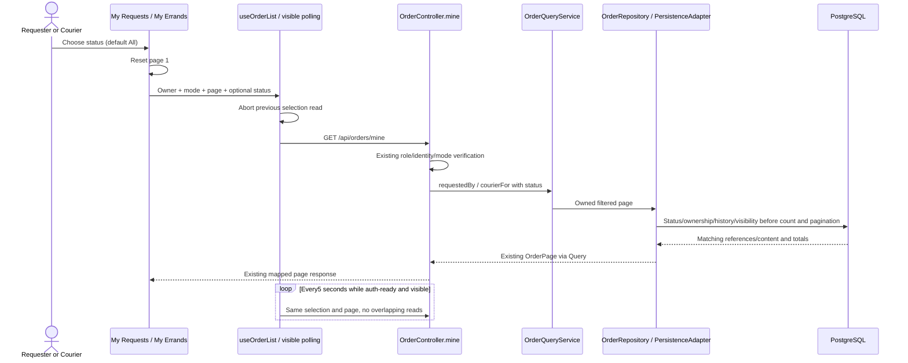
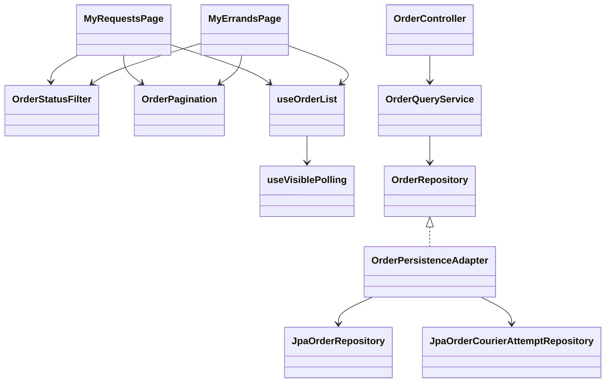

# Personal Order filtering — CHANGE-094 / ADR-032

Approved UI/query refinement; no new peer interaction or data model.

OrderActions changes presentation only: Abort errand still uses existing cancel-accepted sequence/domain rules. Credit and generic polling15 seconds remain. No JPA/API contracts in presentation beyond existing gateway call; DB filtering stays infrastructure-owned.

## Mode-specific status options — CHANGE-095 (2026-10-09)

Requester dropdown excludes ABORTED. Courier dropdown excludes OPEN, EXPIRED and CANCELLED; it retains ABORTED immutable-attempt history. All statuses remains the default. OrderStatusFilter requires an explicit requester/courier mode, supplied by each existing page. This is a UI-only refinement of ADR-032: existing API enum/query, authentication, ownership, pagination and five-second polling remain unchanged.
