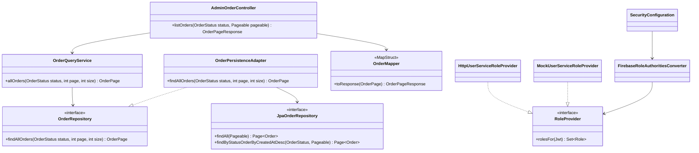

# Admin Order Query Class Diagram (CHANGE-057)

`@PreAuthorize("hasRole('ADMIN')")` protects the controller operation. Database access stays in the infrastructure adapter. The User Service remains authoritative for roles; the mock implementation is restricted to local/mock configuration.
