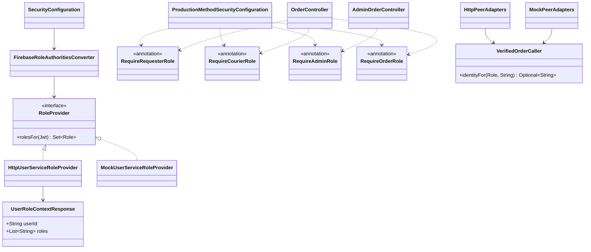

# Role authorization classes (CHANGE-079 / ADR-024)

The production role provider calls User Service once per authenticated request, and annotations inspect the resulting SecurityContext authorities. VerifiedOrderCaller is the shared typed JWT identity guard used by adapters before receipt replay. It does not inspect or load Orders; ownership/state guards remain in the locked domain/application flow. The HTTP adapter preserves fresh courier eligibility; the local mock adapter preserves distinct local actor IDs. No manual RoleAspect, role hierarchy, cross-request cache or database changes.
