# Updated overall-design publisher classes

## Effective compact-event amendment — CHANGE-092 / ADR-031 (2026-10-09)

Yao Xiang approved the exact seven-field Order-only payload: eventId, eventType, orderId, orderStatus, creditAmount, occurredAt, courierId. This replaces full snapshots and overdue facts ONLY for OpenOrderRefundTaskEvent and OrderCompletionTaskEvent. AcceptedOrderCancellationTaskEvent retains its existing v1 envelope/snapshot. Internal outbox versions and Pub/Sub eventVersion attribute remain (compact schema v2); topic names and DB schema unchanged. Old pending snapshot rows normalize at dispatch from their saved facts, with stable IDs. Lifecycle/outbox scheduling, locks, synchronous Credit assignment/reset and ADR-025 abort behavior remain. Historical v1 descriptions below are superseded for these two bodies. Credit currently requires the old snapshot and overdue; FEEDBACK-009 is INCOMPLETE_OR_INCOMPATIBLE. User completion penalties need an agreed separate overdue source. User approved implementing Order-only and documenting peer work; live integration remains blocked, Sprint [~].

```mermaid
classDiagram
    class IEventPublisher~T~ {
        <<interface>>
        +publish(topic, event)
    }
    class GoogleCloudPubSubEventPublisher {
        -projectId: String
        -publishTimeout: Duration
        +publish(topicId, event) String
    }
    class GoogleCloudPubSubPublisherFactory {
        -emulatorHost: String
        +forTopic(projectId, topicId) Publisher
    }
    class IOrderCompletionTaskPublisher {
        <<interface>>
        +publishOrderCompletionTask(OrderCompletionTaskEvent event)
    }
    class OrderCompletionTaskPublisher {
        -topic: String (configured)
        +publishOrderCompletionTask(OrderCompletionTaskEvent event)
    }
    class IOpenOrderRefundTaskPublisher {
        <<interface>>
        +publishOpenOrderRefundTask(OpenOrderRefundTaskEvent event)
    }
    class OpenOrderRefundTaskPublisher {
        -topic: String (configured)
        +publishOpenOrderRefundTask(OpenOrderRefundTaskEvent event)
    }
    class IAcceptedOrderCancellationTaskPublisher {
        <<interface>>
        +publishAcceptedOrderCancellationTask(AcceptedOrderCancellationTaskEvent event)
    }
    class AcceptedOrderCancellationTaskPublisher {
        -topic: String (configured)
        +publishAcceptedOrderCancellationTask(AcceptedOrderCancellationTaskEvent event)
    }
    class OrderEventSnapshot {
        +id: String
        +requesterId: String
        +courierId: String
        +itemDescription: String
        +pickupSupplierId: String
        +deliverySupplierId: String
        +offeredCredits: long
        +status: OrderStatus
        +createdAt: Instant
        +expiresAt: Instant
        +deliveryTimeLimitMinutes: int
        +version: long
        +originalOrderId: String
        +repostedOrderId: String
        +repostPlan: RepostPlanSnapshot
    }
    class RepostPlanSnapshot {
        +enabled: boolean
        +dueAt: Instant
        +creditAmount: long
        +deliveryDurationMinutes: int
        +used: boolean
    }
    class OrderCompletionTaskEvent {
        +eventId: String
        +eventType: String
        +orderId: String
        +orderStatus: OrderStatus
        +creditAmount: long
        +occurredAt: Instant
        +courierId: String
    }
    class OpenOrderRefundTaskEvent {
        +eventId: String
        +eventType: String
        +orderId: String
        +orderStatus: OrderStatus
        +creditAmount: long
        +occurredAt: Instant
        +courierId: String nullable
    }
    class AcceptedOrderCancellationTaskEvent
    class OrderTransitionService {
        +complete(commandId, orderId, requester, version)
        +autoComplete(orderId, now)
    }
    class LifecycleProcessingService {
        +expireDue(now)
        +autoCompleteDue(now)
    }
    class OrderLifecycleScheduler {
        +processDueOrders()
    }
    class CreditServicePort {
        <<interface>>
        +holdForReopen(orderId)
    }
    class MockPeerAdapters
    class HttpPeerAdapters
    class OrderTaskEventFactory
    class OrderTaskEventMapper
    class OrderEventOutboxRepository {
        <<interface>>
        +enqueue(event)
        +claim(eventId, now, leaseExpiry)
        +findDueIds(now, limit) List~String~
        +claimDue(now, leaseExpiry, limit)
        +markPublished(eventId)
        +scheduleRetry(eventId, nextAttemptAt, error)
    }
    class OrderEventOutboxPersistenceAdapter
    class JpaOrderEventOutboxRepository
    class OrderEventOutbox {
        +eventId: String
        +eventType: String
        +payload: String
        +state: OutboxState
        +attemptCount: int
        +nextAttemptAt: Instant
        +leaseUntil: Instant
        +publishedAt: Instant
        +lastError: String
    }
    class OrderOutboxAfterCommitListener
    class OrderOutboxScheduler {
        +dispatchDueEvents()
    }
    class OrderOutboxDispatcher {
        +dispatch(eventId)
        +dispatchDueBatch()
    }
    class CreditServiceConsumer {
        <<existing consumer; compact adaptation pending>>
    }
    class UserServiceConsumer {
        <<future peer consumer; not modified>>
    }

    IOrderCompletionTaskPublisher --|> IEventPublisher
    IOpenOrderRefundTaskPublisher --|> IEventPublisher
    IAcceptedOrderCancellationTaskPublisher --|> IEventPublisher
    OrderCompletionTaskPublisher ..|> IOrderCompletionTaskPublisher
    OpenOrderRefundTaskPublisher ..|> IOpenOrderRefundTaskPublisher
    AcceptedOrderCancellationTaskPublisher ..|> IAcceptedOrderCancellationTaskPublisher
    GoogleCloudPubSubEventPublisher ..|> IEventPublisher
    GoogleCloudPubSubEventPublisher --> GoogleCloudPubSubPublisherFactory
    OrderTransitionService --> OrderTaskEventFactory
    OrderLifecycleScheduler --> LifecycleProcessingService : minute lifecycle cron
    LifecycleProcessingService --> OrderTaskEventFactory
    LifecycleProcessingService --> OrderTransitionService : rechecked automatic completion
    LifecycleProcessingService --> OrderRepository : database cutoff query, lock due orders
    LifecycleProcessingService --> OrderEventOutboxRepository : transactional save
    OrderTransitionService --> CreditServicePort : synchronous reset before every abort
    CreditServicePort <|.. MockPeerAdapters
    CreditServicePort <|.. HttpPeerAdapters
    OrderTaskEventFactory --> OrderTaskEventMapper
    OrderTransitionService --> OrderEventOutboxRepository : transactional save
    OrderEventOutboxRepository <|.. OrderEventOutboxPersistenceAdapter
    OrderEventOutboxPersistenceAdapter --> JpaOrderEventOutboxRepository
    JpaOrderEventOutboxRepository --> OrderEventOutbox
    OrderOutboxAfterCommitListener --> OrderOutboxDispatcher : immediate after commit
    OrderOutboxScheduler --> OrderOutboxDispatcher : cron recovery
    OrderOutboxDispatcher --> OrderEventOutboxRepository : lease / mark / retry
    OrderOutboxDispatcher --> IOrderCompletionTaskPublisher
    OrderOutboxDispatcher --> IOpenOrderRefundTaskPublisher
    OrderOutboxDispatcher --> IAcceptedOrderCancellationTaskPublisher
    OrderCompletionTaskPublisher --> IEventPublisher
    OpenOrderRefundTaskPublisher --> IEventPublisher
    AcceptedOrderCancellationTaskPublisher --> IEventPublisher
    AcceptedOrderCancellationTaskEvent --> OrderEventSnapshot
    OrderEventSnapshot --> RepostPlanSnapshot
    OrderCompletionTaskEvent --> CreditServiceConsumer
    OrderCompletionTaskEvent --> UserServiceConsumer
    AcceptedOrderCancellationTaskEvent --> UserServiceConsumer : every abort penalty
    OpenOrderRefundTaskEvent --> CreditServiceConsumer : requester cancel or scheduled expiry
```

`OpenOrderRefundTaskPublisher` owns the configured shared OPEN-refund topic. `OrderLifecycleScheduler` triggers due-OPEN discovery and due delivered completion once per minute. Expiry persists the `EXPIRED` state, checkpoint, and serialized `OpenOrderRefundTaskEvent` atomically; requester cancellation stays trigger-based and persists the same event type with `CANCELLED` under the same overall Sequence 6. Credit uses the resulting `orderStatus` to distinguish these cases; both refund the transaction. The shared lifecycle scheduler finds `DELIVERED` orders by the delivered-checkpoint cutoff and row lock, then asks `LifecycleProcessingService` to use `OrderTransitionService`'s standard completion flow after 48 hours. This reuses the same completion event/outbox; overdue facts remain internal. `GoogleCloudPubSubEventPublisher` serializes typed events as JSON, adds event metadata as Pub/Sub attributes, and waits for the Pub/Sub message ID before returning. An after-commit listener attempts immediate dispatch; the separate outbox cron recovers due rows. Claims use expiring leases and delivery uses bounded retry backoff. Delivery is at least once, so peer consumers must deduplicate the stable `eventId`. The dispatcher retains a compatibility path for pending legacy outbox rows but creates no new legacy event. Cloud Run scale-to-zero/request-based CPU means in-process crons are not guaranteed while idle; no billing change is included. Peer consumers remain future work and are not modified here.

CHANGE-096: recovery calls findDueIds and individual claim; claim/mark/retry transactions are REQUIRES_NEW, enqueue remains REQUIRED. Legacy claimDue is retained but unused by the active dispatcher. Publication remains outside transactions; catch around each event preserves later work.
