# Updated overall-design publisher classes

```mermaid
classDiagram
    class IEventPublisher~T~ {
        <<interface>>
        +publish(topic, event)
    }
    class GoogleCloudPubSubEventPublisher {
        -projectId: String
        -publishTimeout: Duration
        +publish(topicId, event) String
    }
    class GoogleCloudPubSubPublisherFactory {
        -emulatorHost: String
        +forTopic(projectId, topicId) Publisher
    }
    class IOrderCompletionTaskPublisher {
        <<interface>>
        +publishOrderCompletionTask(OrderCompletionTaskEvent event)
    }
    class OrderCompletionTaskPublisher {
        -topic: String = TODO_TOPIC
        +publishOrderCompletionTask(OrderCompletionTaskEvent event)
    }
    class IOpenOrderCancellationTaskPublisher {
        <<interface>>
        +publishOpenOrderCancellationTask(OpenOrderCancellationTaskEvent event)
    }
    class OpenOrderCancellationTaskPublisher {
        -topic: String = TODO_TOPIC
        +publishOpenOrderCancellationTask(OpenOrderCancellationTaskEvent event)
    }
    class IAcceptedOrderCancellationTaskPublisher {
        <<interface>>
        +publishAcceptedOrderCancellationTask(AcceptedOrderCancellationTaskEvent event)
    }
    class AcceptedOrderCancellationTaskPublisher {
        -topic: String = TODO_TOPIC
        +publishAcceptedOrderCancellationTask(AcceptedOrderCancellationTaskEvent event)
    }
    class OrderEventSnapshot {
        +id: String
        +requesterId: String
        +courierId: String
        +itemDescription: String
        +pickupSupplierId: String
        +deliverySupplierId: String
        +offeredCredits: long
        +status: OrderStatus
        +createdAt: Instant
        +expiresAt: Instant
        +deliveryTimeLimitMinutes: int
        +version: long
        +originalOrderId: String
        +repostedOrderId: String
        +repostPlan: RepostPlanSnapshot
        +checkpoints: List~OrderCheckpointSnapshot~
    }
    class OrderCheckpointSnapshot {
        +id: String
        +status: OrderStatus
        +occurredAt: Instant
        +actorId: String
        +supplierId: String
    }
    class RepostPlanSnapshot {
        +enabled: boolean
        +dueAt: Instant
        +creditAmount: long
        +deliveryDurationMinutes: int
        +used: boolean
    }
    class OrderCompletionTaskEvent {
        +eventId: String
        +eventVersion: int
        +orderVersion: long
        +occurredAt: Instant
        +overdue: boolean
        +overdueAt: Instant
        +actorId: String
        +order: OrderEventSnapshot
    }
    class OpenOrderCancellationTaskEvent
    class AcceptedOrderCancellationTaskEvent
    class OrderTransitionService
    class CreditServicePort {
        <<interface>>
        +holdForReopen(commandId, orderId, requesterId, courierId, amount, expectedOrderVersion)
    }
    class MockPeerAdapters
    class HttpPeerAdapters
    class OrderTaskEventFactory
    class OrderTaskEventMapper
    class OrderEventOutboxRepository {
        <<interface>>
        +enqueue(event)
        +claim(eventId, now, leaseExpiry)
        +claimDue(now, leaseExpiry, limit)
        +markPublished(eventId)
        +scheduleRetry(eventId, nextAttemptAt, error)
    }
    class OrderEventOutboxPersistenceAdapter
    class JpaOrderEventOutboxRepository
    class OrderEventOutbox {
        +eventId: String
        +eventType: String
        +payload: String
        +state: OutboxState
        +attemptCount: int
        +nextAttemptAt: Instant
        +leaseUntil: Instant
        +publishedAt: Instant
        +lastError: String
    }
    class OrderOutboxAfterCommitListener
    class OrderOutboxScheduler {
        +dispatchDueEvents()
    }
    class OrderOutboxDispatcher {
        +dispatch(eventId)
        +dispatchDueBatch()
    }
    class CreditServiceConsumer {
        <<future peer consumer; not modified>>
    }
    class UserServiceConsumer {
        <<future peer consumer; not modified>>
    }

    IOrderCompletionTaskPublisher --|> IEventPublisher
    IOpenOrderCancellationTaskPublisher --|> IEventPublisher
    IAcceptedOrderCancellationTaskPublisher --|> IEventPublisher
    OrderCompletionTaskPublisher ..|> IOrderCompletionTaskPublisher
    OpenOrderCancellationTaskPublisher ..|> IOpenOrderCancellationTaskPublisher
    AcceptedOrderCancellationTaskPublisher ..|> IAcceptedOrderCancellationTaskPublisher
    GoogleCloudPubSubEventPublisher ..|> IEventPublisher
    GoogleCloudPubSubEventPublisher --> GoogleCloudPubSubPublisherFactory
    OrderTransitionService --> OrderTaskEventFactory
    OrderTransitionService --> CreditServicePort : synchronous hold before unexpired reopen
    CreditServicePort <|.. MockPeerAdapters
    CreditServicePort <|.. HttpPeerAdapters
    OrderTaskEventFactory --> OrderTaskEventMapper
    OrderTransitionService --> OrderEventOutboxRepository : transactional save
    OrderEventOutboxRepository <|.. OrderEventOutboxPersistenceAdapter
    OrderEventOutboxPersistenceAdapter --> JpaOrderEventOutboxRepository
    JpaOrderEventOutboxRepository --> OrderEventOutbox
    OrderOutboxAfterCommitListener --> OrderOutboxDispatcher : immediate after commit
    OrderOutboxScheduler --> OrderOutboxDispatcher : cron recovery
    OrderOutboxDispatcher --> OrderEventOutboxRepository : lease / mark / retry
    OrderOutboxDispatcher --> IOrderCompletionTaskPublisher
    OrderOutboxDispatcher --> IOpenOrderCancellationTaskPublisher
    OrderOutboxDispatcher --> IAcceptedOrderCancellationTaskPublisher
    OrderCompletionTaskPublisher --> IEventPublisher
    OpenOrderCancellationTaskPublisher --> IEventPublisher
    AcceptedOrderCancellationTaskPublisher --> IEventPublisher
    OrderCompletionTaskEvent --> OrderEventSnapshot
    OpenOrderCancellationTaskEvent --> OrderEventSnapshot
    AcceptedOrderCancellationTaskEvent --> OrderEventSnapshot
    OrderEventSnapshot --> OrderCheckpointSnapshot
    OrderEventSnapshot --> RepostPlanSnapshot
    OrderCompletionTaskEvent --> CreditServiceConsumer
    OrderCompletionTaskEvent --> UserServiceConsumer
    AcceptedOrderCancellationTaskEvent --> UserServiceConsumer : expired cancellation penalty
    OpenOrderCancellationTaskEvent --> CreditServiceConsumer
    AcceptedOrderCancellationTaskEvent --> CreditServiceConsumer : expired cancellation refund
```

Each task publisher owns a topic placeholder to be filled later, as requested. `GoogleCloudPubSubEventPublisher` serializes the typed event as JSON, adds event metadata as Pub/Sub attributes, and waits for the Pub/Sub message ID before returning. Every outbox row stores the serialized post-transition event atomically with Order state, checkpoint, and command receipt. An after-commit listener attempts immediate dispatch; a cron scheduler recovers due rows. Claims use expiring leases and delivery uses bounded retry backoff. Delivery is at least once, so peer consumers must deduplicate the stable `eventId`. Cloud Run scale-to-zero/request-based CPU means cron recovery is not guaranteed while idle; no billing change is included. Peer consumers remain future work and are not modified here.
