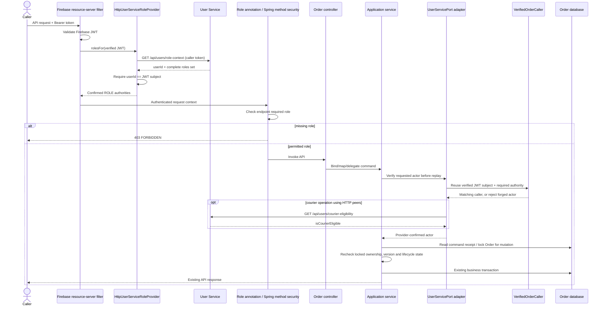

# Shared production authorization sequence (CHANGE-079 / ADR-024)

This prefix applies to human Order APIs; local !prod bypasses token/method-role security and retains adapter mock identities. System schedulers and lifecycle-token routes keep their existing separate authorization.

Invalid/missing tokens return 401. Failed/malformed role lookup (including a mismatched response identity) returns 503. Local HTTP peers still call role-context because no authenticated Spring JWT context exists in !prod. Shared read APIs allow any recognized role; /mine verifies the role for its selected mode. Each subsequent request resolves roles again, avoiding stale authorization caches.
