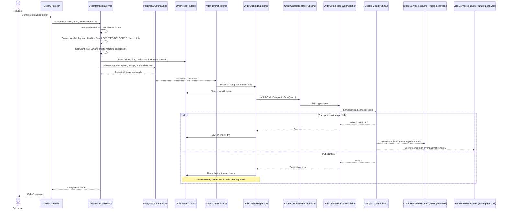

# Sequence 5: Complete an order

The same `OrderCompletionTaskEvent` is published for every completion. It includes the complete resulting Order snapshot, `overdue`, and `overdueAt` (the delivery deadline). Credit Service transfers/settles the reserved credits to the courier. User Service applies the overdue penalty when `overdue` is true; otherwise it reduces the courier's penalty score under its existing policy. Overdue is true only when delivery occurred strictly after the deadline. The Order state and event intent commit atomically. Immediate delivery is attempted after commit, and cron recovers failed or interrupted attempts. A crash after Pub/Sub accepts the message but before the outbox marker commits can cause a duplicate; consumers deduplicate using stable `eventId`. Peer replies are not awaited. The topic ID remains `TODO_TOPIC` until configured.
