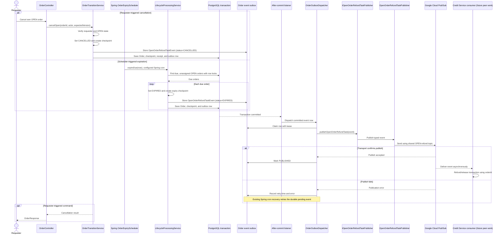

# Sequence 6: Cancel or expire an OPEN order

Requester cancellation is trigger-based and records `CANCELLED`; scheduled expiry records `EXPIRED`. Both persist one `OpenOrderRefundTaskEvent` with the full resulting Order/repost snapshot but no checkpoint history. Credit subscribes to one shared OPEN-refund topic and refunds/releases the transaction for either status; no User Service subscriber is involved. The `order.status` field lets Credit distinguish the outcome if it needs to. State, checkpoint, and event intent commit atomically; publication happens after commit through one typed publisher. Order Service does not await Credit's subscriber. Delivery is at least once and Credit must deduplicate by stable event ID. The production topic remains a placeholder for later configuration; local Compose initializes `open-order-refund-v1`. The dispatcher also translates pending legacy cancellation/expiration outbox records to the new event shape while preserving their event IDs. Cloud Run scale-to-zero with request-based CPU does not guarantee this in-process schedule runs while idle.
