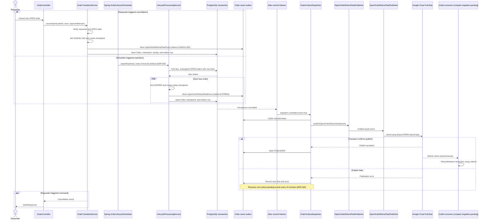

# Sequence 6: Cancel or expire an OPEN order

## Effective compact-event amendment — CHANGE-092 / ADR-031 (2026-10-09)

Yao Xiang approved the exact seven-field Order-only payload: eventId, eventType, orderId, orderStatus, creditAmount, occurredAt, courierId. This replaces full snapshots and overdue facts ONLY for OpenOrderRefundTaskEvent and OrderCompletionTaskEvent. AcceptedOrderCancellationTaskEvent retains its existing v1 envelope/snapshot. Internal outbox versions and Pub/Sub eventVersion attribute remain (compact schema v2); topic names and DB schema unchanged. Old pending snapshot rows normalize at dispatch from their saved facts, with stable IDs. Lifecycle/outbox scheduling, locks, synchronous Credit assignment/reset and ADR-025 abort behavior remain. Historical v1 descriptions below are superseded for these two bodies. Credit currently requires the old snapshot and overdue; FEEDBACK-009 is INCOMPLETE_OR_INCOMPATIBLE. User completion penalties need an agreed separate overdue source. User approved implementing Order-only and documenting peer work; live integration remains blocked, Sprint [~].

Requester cancellation is trigger-based and records `CANCELLED`; scheduled expiry records `EXPIRED`. Both persist one `OpenOrderRefundTaskEvent` with exactly the seven-field resulting Order body. Credit subscribes to one shared OPEN-refund topic and, after compact-consumer migration (FEEDBACK-009), refunds/releases the transaction for either status; no User Service subscriber is involved. The `orderStatus` field lets Credit distinguish the outcome if it needs to. State, checkpoint, and event intent commit atomically; publication happens after commit through one typed publisher. Order Service does not await Credit's subscriber. Delivery is at least once and Credit must deduplicate by stable event ID. The topic is configured through `ORDER_OPEN_REFUND_TOPIC`: local/staging use `open-order-refund-dev-v1`, production uses `open-order-refund-prod-v1` (CHANGE-073/076). The dispatcher also translates pending legacy cancellation/expiration outbox records to the new event shape while preserving their event IDs. Cloud Run scale-to-zero with request-based CPU does not guarantee this in-process schedule runs while idle.

CHANGE-077/ADR-022 limits new Requester UI timestamp choices to quarter-hours. The expiry DB query still selects all due orders, including older/direct API timestamps. Actual deadline checks remain independent of the current minute-based scan; immediate after-commit event publication is unchanged.
