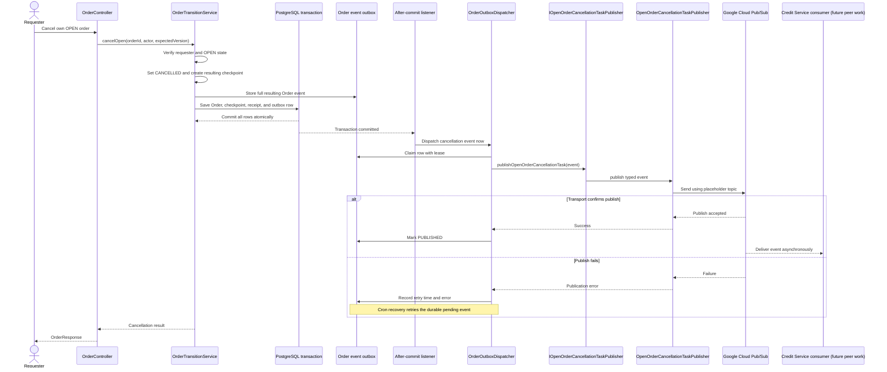

# Sequence 6: Cancel an OPEN order

The Order state, checkpoint, receipt, and cancellation event intent commit atomically. Credit's consumer reply is not awaited. Immediate publish follows commit; cron retries a failed or interrupted attempt. Delivery is at least once and Credit must deduplicate by stable event ID. OPEN expiry is a separate existing lifecycle path and is not covered by this cancellation publisher. The topic ID remains `TODO_TOPIC` until configured.
