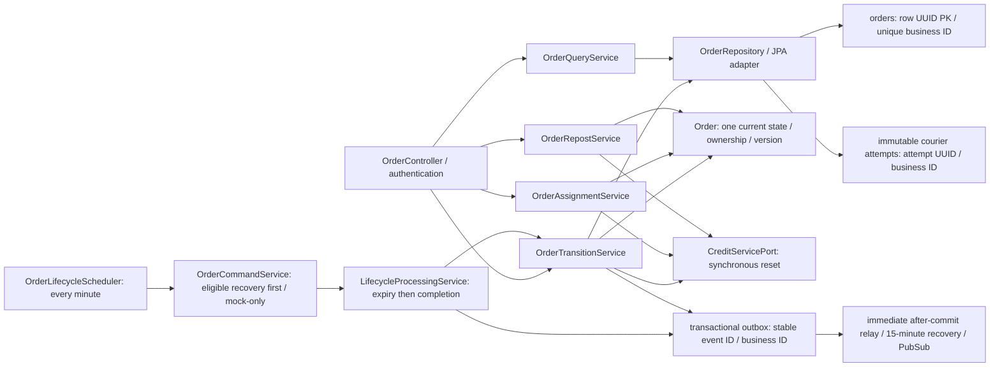
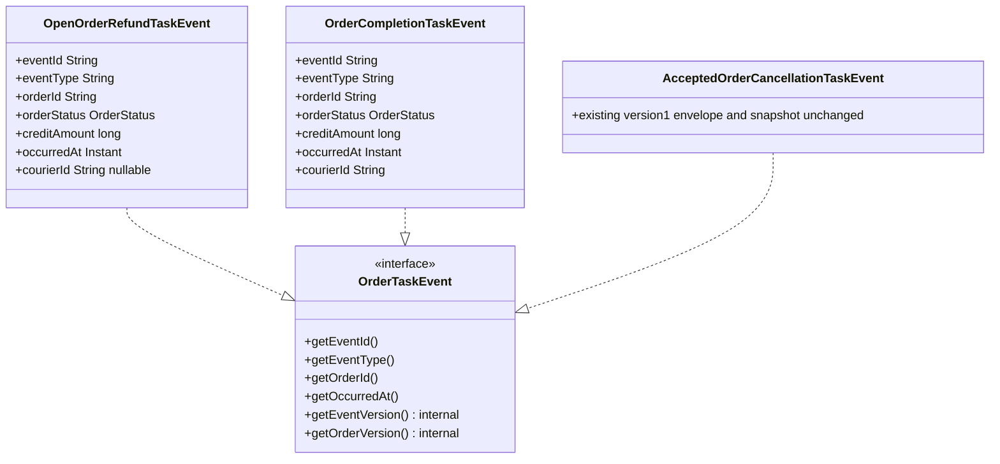
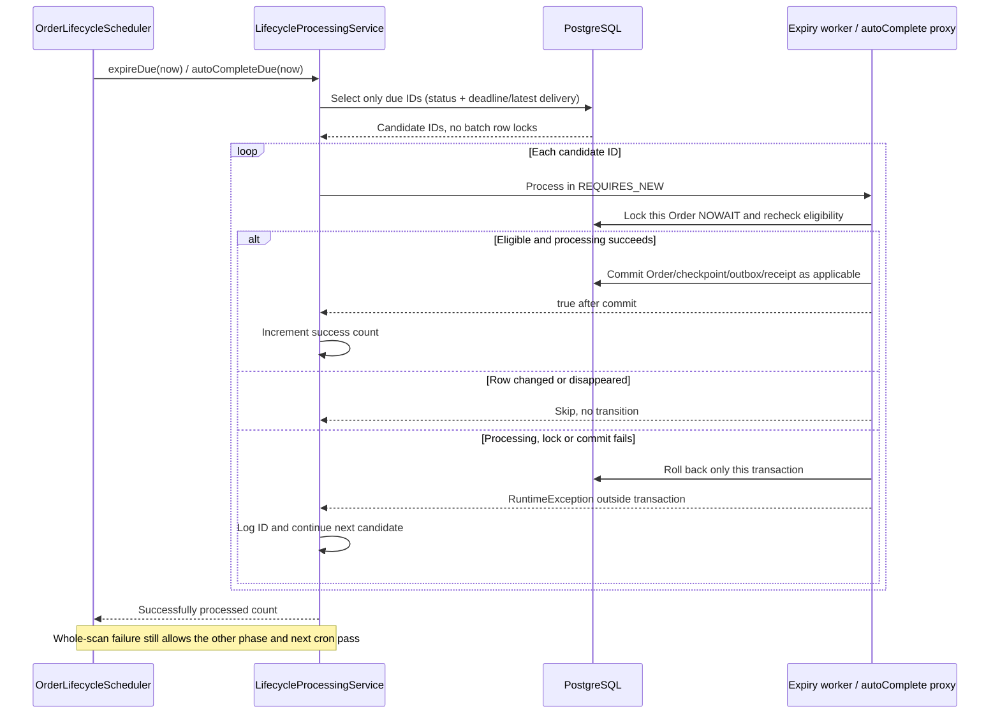
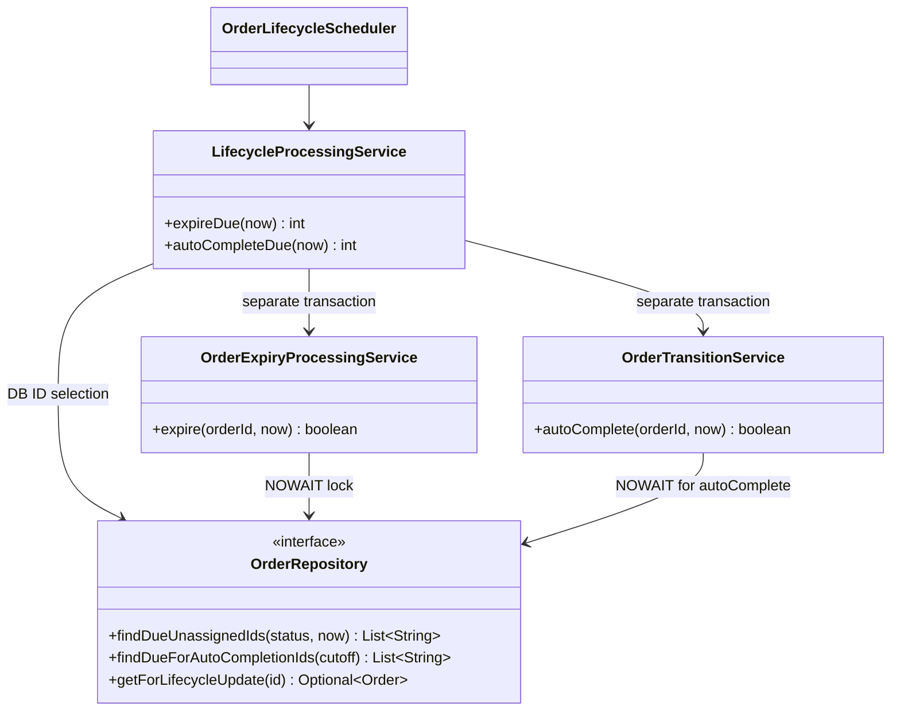

# Sprint 2-3: Order-owned effective design and verification

## Recovery-first shared minute job — CHANGE-102 / ADR-034

The independent command timer is removed. `order.lifecycle.cron` controls one
minute tick: eligible recovery -> OPEN expiry -> >=48-hour completion. Lifecycle
time is captured after recovery; failures do not suppress subsequent phases.
Existing HTTP recovery hard gate, locks/leases/unresolved guards and all item
transactions remain. Outbox remains immediate plus every 15 minutes. This
supersedes only timer ownership in ADR-026/033; Sprint stays `[~]`.

## Foreground recovery stub slice — CHANGE-100 / ADR-033

Vincent approves durable CREATE/ACCEPT/CANCEL_ACCEPTED recovery with same-key
browser persistence, Order-owned V5 intent/lease/result records and companion
pending UI. The effective feature class/sequence/data contracts and Credit
handoff are [concurrency-order-credit.md](../../concurrency/concurrency-order-credit.md).
Only the contract stub is implemented/verified here; HTTP recovery is hard
disabled and real peer/browser/crash gates remain open. Repost recovery and
delegated credentials remain deferred. Sprint `[~]`; FEEDBACK-010/003/006 `[!]`.

## Order personal filters and five-second polling — CHANGE-094 / ADR-032 (2026-10-09)

Yao Xiang explicitly requests five-second Order UI polling, Abort errand wording, and status filters on My Errands/My Requests. The existing /api/orders/mine adds optional status; default all, invalid status 400, existing identity/mode checks and page envelope retained. Database filters before page/count, preserving ABORTED courier attempts and hidden successfully reposted requester originals. Existing Base UI filters/pagination reset page 1 and cancel stale reads. Order-only polling is5 seconds; Credit/generic default 15 seconds; auth/visibility/no-overlap/focus/mutation protections retained. No scheduler, event, peer, schema or background-retry change. Verification and limits: CHANGE-094. Historical Order interval descriptions are superseded only by this approved amendment.

## Lifecycle per-order failure isolation — CHANGE-093 (2026-10-09)

Yao Xiang explicitly requests failed scheduled tasks be skipped while later successes continue. Due selection returns IDs filtered in the DB (latest delivery cutoff for completion), without locking a whole batch. Nontransactional lifecycle coordinator calls fresh NOWAIT-locking per-order transactions (expiry worker / existing autoComplete with REQUIRES_NEW), catches each RuntimeException including commit failures, logs order ID, counts only successful transitions, then continues. Scheduler retains independent whole-pass catches. Failed orders remain eligible next normal lifecycle pass; no new repost retry mechanism or cron/contract/schema/peer change. Previous batch transaction description is superseded by this refinement; CHANGE-092 compact payloads and FEEDBACK-009 remain unchanged.


## Effective compact-event amendment — CHANGE-092 / ADR-031 (2026-10-09)

Yao Xiang approved the exact seven-field Order-only payload: eventId, eventType, orderId, orderStatus, creditAmount, occurredAt, courierId. This replaces full snapshots and overdue facts ONLY for OpenOrderRefundTaskEvent and OrderCompletionTaskEvent. AcceptedOrderCancellationTaskEvent retains its existing v1 envelope/snapshot. Internal outbox versions and Pub/Sub eventVersion attribute remain (compact schema v2); topic names and DB schema unchanged. Old pending snapshot rows normalize at dispatch from their saved facts, with stable IDs. Lifecycle/outbox scheduling, locks, synchronous Credit assignment/reset and ADR-025 abort behavior remain. Historical v1 descriptions below are superseded for these two bodies. Credit currently requires the old snapshot and overdue; FEEDBACK-009 is INCOMPLETE_OR_INCOMPATIBLE. User completion penalties need an agreed separate overdue source. User approved implementing Order-only and documenting peer work; live integration remains blocked, Sprint [~].


## Effective CHANGE-091 validation

New plans: repostExpiresAt >= repostDueAt + 30 minutes, due >= original expiry.
New manual submissions: expiry >= submission + 30 minutes. Saved explicit-expiry
automatic plans keep their original settings, and late execution needs only a
still-future saved expiry. No V4 edit, schema or scheduler change. Creation and
manual validation return actual field details before reservation. Responsive
Requester forms show inline reasons; no generic list of unrelated possibilities.
Order remains authority; User/Supplier/Credit contracts and paused retries remain.


## Effective CHANGE-086 implementation

Vincent's explicit automatic expiry and saved latest manual/automatic outcomes
are implemented, using V4 and the existing Order frontend slice. Strict rule:
expiry > due >= original expiry; late processing uses the exact saved future
expiry. Legacy enabled plans without expiry are disabled, not backfilled.
Failure retains EXPIRED/unlinked original and safe latest code/message/time;
success clears it. Failure is written after rollback, not as partial business
success. Background retry/security scope remains paused and Sprint remains [~].
Older incomplete descriptions below are historical; see CHANGE-086 for results.


Developer Vincent, branch `sprint-2-3`. Authority: Project D1, user-selected `Order Service Overall Doc.pdf`, retained prior approvals, CHANGE-081/082 and ADR-025. This is the requested lifecycle/history slice, NOT completion of all Admin/report/hold capabilities in the overall pack. Source PDF/PNG diagrams remain unchanged; these editable diagrams express the approved override.

## Class and data responsibilities

CHANGE-085 follow-up: authenticated visible-page 15-second polling and current
manual EXPIRED-card failure messages are implemented. Reusable frontend
useVisiblePolling handles timers/cleanup; useOrderList handles account/path
ownership and revision guards; useCreditBalance retains mutation invalidation.
Backend HttpPeerAdapters preserves only confirmed INSUFFICIENT_CREDITS as that
semantic error. ALL background retry implementation is explicitly PAUSED until
peer agreement; credentials remain documentation-only. No new task/data schema.
Earlier unimplemented wording below is historical approval context.

CHANGE-084 / ADR-027 records approved polling and durable fixed-candidate-ID
temporary retry limits/terminal EXPIRED messages. These are NOT implemented.
Trusted unattended peer credentials are documented for discussion ONLY; do not
implement until the user resumes that scope and provider contracts are agreed.
The diagram below describes existing classes, not a new retry worker/table.

CHANGE-083 / ADR-026 uses one OrderLifecycleScheduler every minute for expiry
and >=48h completion, with 15-minute recovery and immediate dispatch retained.
See [the updated target diagram and gap table](../../docs/diagrams/order-lifecycle-reconciliation.md).
Explicit automatic repost expiry/durable retries/failure UI remain incomplete.



User/Supplier ports remain authoritative identity/catalogue providers. `OrderCourierAttempt` is a snapshot, not a second current aggregate. Checkpoints can repeat statuses and remain chronological. Events contain current Order fields, not internal row/attempt IDs. Credit owns funds, User owns penalties.

## Abort sequence (overall Sequence 7; D1 F11.2)

```mermaid
sequenceDiagram
  participant FE as My Errands
  participant APP as Order controller / transition service
  participant DOMAIN as locked current Order
  participant CREDIT as Credit reset API
  participant DB as Order PostgreSQL
  participant BROKER as PubSub via outbox relay
  FE->>APP: cancel-accepted(commandId, actorId, expectedVersion)
  APP->>DOMAIN: verify authenticated assigned courier, ACCEPTED only, version
  APP->>CREDIT: POST /orders/{businessId}/hold-for-reopen (no body)
  CREDIT-->>APP: bodyless 200; courier null, reservation retained
  APP->>DOMAIN: recheck expiry after Credit response
  APP->>DB: atomic attempt + checkpoints + OPEN/EXPIRED + receipt + penalty intent
  opt deadline reached
    APP->>DB: same transaction: old-business-ID refund intent
  end
  APP->>BROKER: after COMMIT publish penalty and, if EXPIRED, refund
  APP-->>FE: current OPEN/EXPIRED; refetch courier timeline including ABORTED attempt
```

Before expiry only User receives an abort penalty event. At/after expiry Credit ALSO receives the refund event. Requester sees the current state, not an ABORTED card. Courier history includes every immutable attempt, using `attemptId` as UI key, even when the same courier accepts/aborts the same business order again.

## Repost and completion

Overall Sequences 11/12 (NTH4): expired original -> validate requester/suppliers -> reserve NEW order ID -> save new OPEN + bidirectional original/repost linkage -> requester query hides linked EXPIRED original before pagination. Reservation failure leaves original visible and unlinked. Receipt replay validates requester and original linkage, with no second reservation. No repost event was approved.

Overall Sequences 5/8 (F6.4/F7 and approved overdue amendment): requester completion OR minute scan after latest DELIVERED checkpoint + 48h -> lock/recheck -> compute overdue from latest acceptance/delivery -> COMPLETED + checkpoint/receipt/completion outbox atomically. Credit/User consume their own consequences; scheduler does not directly settle funds.

## Effective requirements and evidence

| Requirement | Order-owned evidence | Completion state |
| --- | --- | --- |
| F3/F4.1.1 acceptance | Existing assignment/HTTP tests: wait for Credit, failure/no writes, expiry recheck | Tested against contract stubs; provider missing |
| F8/F9, F11.2.1/.2 history | Snapshot/unit and real PostgreSQL repeated-attempt/ownership/pagination tests; RTL My Errands reload | Locally verified; browser pending |
| F10/F11.1/.2 abort/refund/penalty | State/version/ownership guards, reset failure, deadline-during-reset, outbox and PostgreSQL rollback tests | Order verified; peer subscribers pending |
| NTH4 + F10.1.3 approved override | Reserve failure, authenticated replay, original hiding/count, real PostgreSQL visibility and RTL manual-repost update | Local verification; trusted auto-repost credential missing |
| F6.4/F7 + approved F12 amendment | 48h/cadence tests and latest checkpoint regression; normal outbox tests | Local verification; deployed idle scheduler pending |
| NFR3.1.1 | Fresh Maven verify  >=80% lines and branches; exact results in CHANGE-082 | Gate passed locally |

Do not confuse overall diagrams 1-12 with Sprint 1's diagrams 1-11. NTH1 all-orders API exists; full NTH3 report/hold/resolution Order APIs/UI are not established by this lifecycle change. Inspect/approve those contracts before implementing them rather than marking all of Sprint 3 complete.

## Reproduce safely

Use Java 21 and a running Docker engine, then `cd order-service` and `mvnw.cmd -B -ntp verify` on Windows (`./mvnw -B -ntp verify` on Linux). Testcontainers uses isolated PostgreSQL databases, not the application volume. In `frontend`, run `npm ci`, `npm test`, `npm run lint`, `npm run typecheck`, `npm run build`.

After backup/review and image rebuild, application startup applies V3 through Flyway; do not edit V1/V2, run ddl-auto=update, or delete application volumes. HTTP mode must wait for the peer APIs in feedback; a mock test is not a production credit/refund test. Browser, live PubSub consumer and Cloud Run checks remain explicit follow-up gates.


### Compact publication bodies (CHANGE-092)

```mermaid
sequenceDiagram
    participant Flow as Completion / cancellation / expiry
    participant DB as Order + outbox
    participant Dispatch as After-commit / recovery
    participant Broker as Existing Pub/Sub topics
    participant Peers as Credit / User
    Flow->>DB: Commit terminal state and compact intent atomically
    DB-->>Dispatch: After commit signal (or recovery claim)
    Dispatch->>Dispatch: Normalize legacy saved snapshots; restore internal versions
    Dispatch->>Broker: Seven-field JSON; schema version 2 attribute
    Broker-->>Dispatch: Message ID
    Dispatch->>DB: Mark published
    Broker-->>Peers: Delivery (consumer migration required)
    Note over Peers: FEEDBACK-009: Credit currently rejects shape; User overdue source unresolved
```



No persistence column/type change. JsonIgnore metadata is retained only in outbox columns/attributes; it is not part of the two compact bodies.


## Per-order scheduler failure boundaries — CHANGE-093





No entity/schema migration. The expiry worker owns its atomic expiry/checkpoint/refund intent; completion retains its existing receipt/outbox flow. Normal command locks, status rules, compact payloads, cron cadence, peer integration blockers and paused automatic repost work are unchanged.

## Mode-specific status options — CHANGE-095 (2026-10-09)

Requester dropdown excludes ABORTED. Courier dropdown excludes OPEN, EXPIRED and CANCELLED; it retains ABORTED immutable-attempt history. All statuses remains the default. OrderStatusFilter requires an explicit requester/courier mode, supplied by each existing page. This is a UI-only refinement of ADR-032: existing API enum/query, authentication, ownership, pagination and five-second polling remain unchanged.

## Scheduler DB selection and independent outbox dispatch — CHANGE-096 (2026-10-10)

The active lifecycle paths retain CHANGE-093: DB-filtered IDs, separate REQUIRES_NEW expiry/completion workers, fresh NOWAIT locks and outside-proxy catch. Outbox recovery now selects bounded eligible event IDs in SQL (due PENDING or expired IN_PROGRESS lease), then individually claims/rechecks with SKIP LOCKED. Claim, markPublished and scheduleRetry use separate REQUIRES_NEW transactions; enqueue remains REQUIRED with Order/checkpoint/receipt. Dispatcher catches each event's claim/commit/retry-write errors, logs its ID and continues later events. A failed retry write leaves the committed lease recoverable after expiry. Neither scheduler nor batch coordinator is transactional. Pub/Sub publication stays outside DB transactions and is irreversible; stable-ID deduplication remains required. Legacy claimDue is retained for compatibility, unused by the active scheduler. No cadence, schema, event body, peer, frontend or paused repost change.
