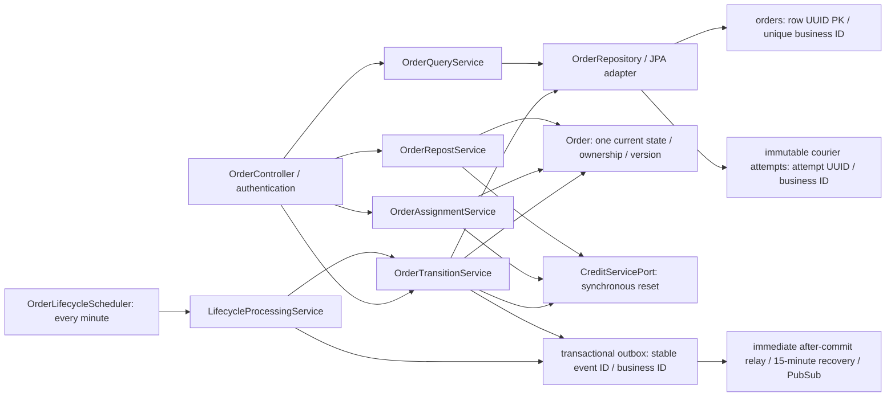

# Sprint 2-3: Order-owned effective design and verification

## Effective CHANGE-086 implementation

Vincent's explicit automatic expiry and saved latest manual/automatic outcomes
are implemented, using V4 and the existing Order frontend slice. Strict rule:
expiry > due >= original expiry; late processing uses the exact saved future
expiry. Legacy enabled plans without expiry are disabled, not backfilled.
Failure retains EXPIRED/unlinked original and safe latest code/message/time;
success clears it. Failure is written after rollback, not as partial business
success. Background retry/security scope remains paused and Sprint remains [~].
Older incomplete descriptions below are historical; see CHANGE-086 for results.


Developer Vincent, branch `sprint-2-3`. Authority: Project D1, user-selected `Order Service Overall Doc.pdf`, retained prior approvals, CHANGE-081/082 and ADR-025. This is the requested lifecycle/history slice, NOT completion of all Admin/report/hold capabilities in the overall pack. Source PDF/PNG diagrams remain unchanged; these editable diagrams express the approved override.

## Class and data responsibilities

CHANGE-085 follow-up: authenticated visible-page 15-second polling and current
manual EXPIRED-card failure messages are implemented. Reusable frontend
useVisiblePolling handles timers/cleanup; useOrderList handles account/path
ownership and revision guards; useCreditBalance retains mutation invalidation.
Backend HttpPeerAdapters preserves only confirmed INSUFFICIENT_CREDITS as that
semantic error. ALL background retry implementation is explicitly PAUSED until
peer agreement; credentials remain documentation-only. No new task/data schema.
Earlier unimplemented wording below is historical approval context.

CHANGE-084 / ADR-027 records approved polling and durable fixed-candidate-ID
temporary retry limits/terminal EXPIRED messages. These are NOT implemented.
Trusted unattended peer credentials are documented for discussion ONLY; do not
implement until the user resumes that scope and provider contracts are agreed.
The diagram below describes existing classes, not a new retry worker/table.

CHANGE-083 / ADR-026 uses one OrderLifecycleScheduler every minute for expiry
and >=48h completion, with 15-minute recovery and immediate dispatch retained.
See [the updated target diagram and gap table](../../docs/diagrams/order-lifecycle-reconciliation.md).
Explicit automatic repost expiry/durable retries/failure UI remain incomplete.



User/Supplier ports remain authoritative identity/catalogue providers. `OrderCourierAttempt` is a snapshot, not a second current aggregate. Checkpoints can repeat statuses and remain chronological. Events contain current Order fields, not internal row/attempt IDs. Credit owns funds, User owns penalties.

## Abort sequence (overall Sequence 7; D1 F11.2)

```mermaid
sequenceDiagram
  participant FE as My Errands
  participant APP as Order controller / transition service
  participant DOMAIN as locked current Order
  participant CREDIT as Credit reset API
  participant DB as Order PostgreSQL
  participant BROKER as PubSub via outbox relay
  FE->>APP: cancel-accepted(commandId, actorId, expectedVersion)
  APP->>DOMAIN: verify authenticated assigned courier, ACCEPTED only, version
  APP->>CREDIT: POST /orders/{businessId}/hold-for-reopen (no body)
  CREDIT-->>APP: bodyless 200; courier null, reservation retained
  APP->>DOMAIN: recheck expiry after Credit response
  APP->>DB: atomic attempt + checkpoints + OPEN/EXPIRED + receipt + penalty intent
  opt deadline reached
    APP->>DB: same transaction: old-business-ID refund intent
  end
  APP->>BROKER: after COMMIT publish penalty and, if EXPIRED, refund
  APP-->>FE: current OPEN/EXPIRED; refetch courier timeline including ABORTED attempt
```

Before expiry only User receives an abort penalty event. At/after expiry Credit ALSO receives the refund event. Requester sees the current state, not an ABORTED card. Courier history includes every immutable attempt, using `attemptId` as UI key, even when the same courier accepts/aborts the same business order again.

## Repost and completion

Overall Sequences 11/12 (NTH4): expired original -> validate requester/suppliers -> reserve NEW order ID -> save new OPEN + bidirectional original/repost linkage -> requester query hides linked EXPIRED original before pagination. Reservation failure leaves original visible and unlinked. Receipt replay validates requester and original linkage, with no second reservation. No repost event was approved.

Overall Sequences 5/8 (F6.4/F7 and approved overdue amendment): requester completion OR minute scan after latest DELIVERED checkpoint + 48h -> lock/recheck -> compute overdue from latest acceptance/delivery -> COMPLETED + checkpoint/receipt/completion outbox atomically. Credit/User consume their own consequences; scheduler does not directly settle funds.

## Effective requirements and evidence

| Requirement | Order-owned evidence | Completion state |
| --- | --- | --- |
| F3/F4.1.1 acceptance | Existing assignment/HTTP tests: wait for Credit, failure/no writes, expiry recheck | Tested against contract stubs; provider missing |
| F8/F9, F11.2.1/.2 history | Snapshot/unit and real PostgreSQL repeated-attempt/ownership/pagination tests; RTL My Errands reload | Locally verified; browser pending |
| F10/F11.1/.2 abort/refund/penalty | State/version/ownership guards, reset failure, deadline-during-reset, outbox and PostgreSQL rollback tests | Order verified; peer subscribers pending |
| NTH4 + F10.1.3 approved override | Reserve failure, authenticated replay, original hiding/count, real PostgreSQL visibility and RTL manual-repost update | Local verification; trusted auto-repost credential missing |
| F6.4/F7 + approved F12 amendment | 48h/cadence tests and latest checkpoint regression; normal outbox tests | Local verification; deployed idle scheduler pending |
| NFR3.1.1 | Fresh Maven verify >=80% lines and branches; exact results in CHANGE-082 | Gate passed locally |

Do not confuse overall diagrams 1-12 with Sprint 1's diagrams 1-11. NTH1 all-orders API exists; full NTH3 report/hold/resolution Order APIs/UI are not established by this lifecycle change. Inspect/approve those contracts before implementing them rather than marking all of Sprint 3 complete.

## Reproduce safely

Use Java 21 and a running Docker engine, then `cd order-service` and `mvnw.cmd -B -ntp verify` on Windows (`./mvnw -B -ntp verify` on Linux). Testcontainers uses isolated PostgreSQL databases, not the application volume. In `frontend`, run `npm ci`, `npm test`, `npm run lint`, `npm run typecheck`, `npm run build`.

After backup/review and image rebuild, application startup applies V3 through Flyway; do not edit V1/V2, run ddl-auto=update, or delete application volumes. HTTP mode must wait for the peer APIs in feedback; a mock test is not a production credit/refund test. Browser, live PubSub consumer and Cloud Run checks remain explicit follow-up gates.
